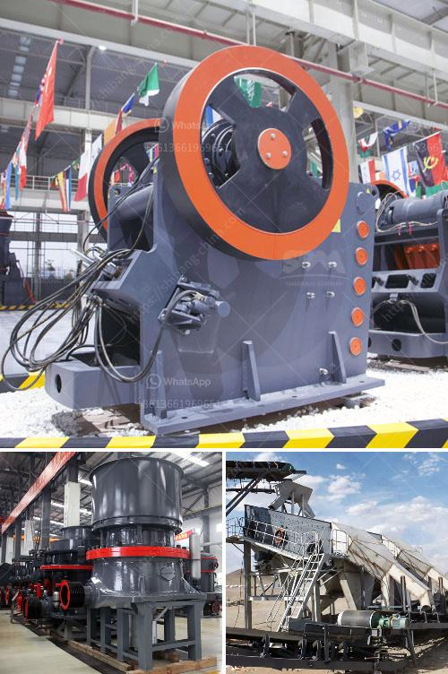

<h3>fully mobile limestone crusher</h3>
The construction industry is consistently thriving due to the increasing demand for infrastructure projects. One of the most crucial raw materials in construction is limestone, which is used as crushed stone for road and building foundations, as well as as an aggregate in concrete and asphalt. To meet the rising demand for limestone, mining companies have been utilizing fully mobile limestone crushers.

A fully mobile limestone crusher is a compact design that incorporates the latest technology with ease of mobility. This makes it a valuable tool for construction companies, who can utilize a fully mobile limestone crusher to eliminate the need for transportation and thus reduce their carbon footprint.

The fully mobile limestone crusher is designed to provide easy transportation, constant and secured operations, and quick installation. Its biggest advantage is that it can move easily between different sites, making it the perfect solution for construction projects that require limestone at multiple locations. This eliminates the need for multiple crushers and reduces transportation costs significantly.

Furthermore, a fully mobile limestone crusher offers flexibility in terms of crushing and screening operations. It can be adjusted to produce different sizes of crushed limestone, depending on the specific requirements of the construction project. This flexibility enhances the efficiency of the crusher, making it ideal for various construction applications.

In addition to its mobility and flexibility, a fully mobile limestone crusher also offers high durability and low maintenance requirements. It is engineered to withstand the harsh conditions of a construction site and perform consistently. Its strong construction ensures that it can handle heavy-duty operations, while its low maintenance requirements reduce downtime and increase productivity.

The utilization of a fully mobile limestone crusher in the construction industry has several benefits. Not only does it simplify operations and reduce transportation costs, but it also contributes to environmental sustainability by reducing carbon emissions. With its ease of mobility, flexibility, and durability, a fully mobile limestone crusher is undoubtedly a valuable investment for any construction company.
<h3>Contact us</h3><ul><li><strong>Whatsapp:&nbsp;<a href="https://wa.me/8613661969651">+8613661969651</a></strong></li><li><a href="https://swt.shibang-china.com/?git&amp;zhl&amp;fully mobile limestone crusher"><strong>Online Service(chat now)</strong></a></li></ul><h3>Related</h3><ul><li><a href='calcium oxide powder grinders.md'>calcium oxide powder grinders</a></li><li><a href='wet process of cement production.md'>wet process of cement production</a></li><li><a href='quarry equipment sale in usa.md'>quarry equipment sale in usa</a></li><li><a href='impact crusher for sale philippines.md'>impact crusher for sale philippines</a></li><li><a href='pictures of copper ore mining nigeria.md'>pictures of copper ore mining nigeria</a></li></ul>