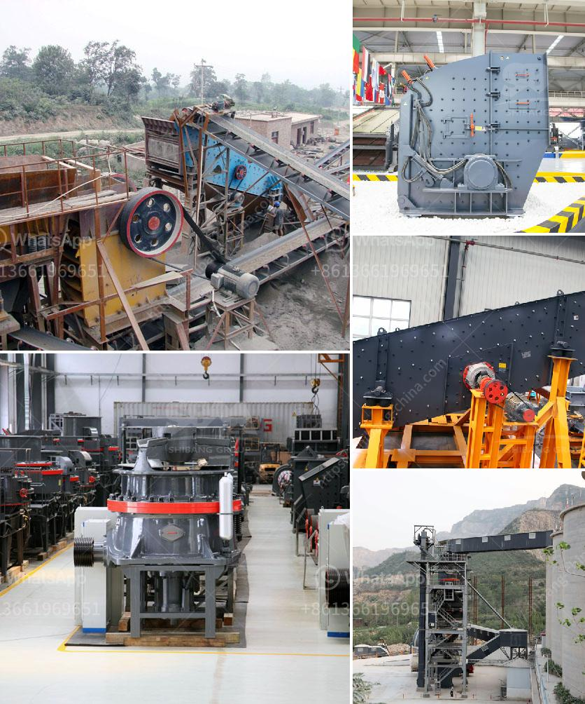

<h3>functions of gyratory crusher</h3>
A gyratory crusher is a machine that crushes materials in the form of a concave surface and a conical head. It is commonly used in mines, quarries, and various industries to break down larger pieces of rock.

Gyratory crushers are often used as primary crushers in mineral processing plants to reduce the size of ore into manageable chunks. The inner cone has a slight circular movement, but does not rotate. The gyratory crusher works by reducing the size of the material through compression, rather than by impact.

The main function of the gyratory crusher is to perform large-scale concrete crushing tasks and also to provide the fine-grained sand necessary for the construction industry. A gyratory crusher is also suitable for more abrasive materials, such as concrete and can produce high-quality aggregates.

The cone crusher is another compression crusher, which is widely used in the crushing of abrasive rocks such as lignite, granite, and limestone. These machines are more productive compared to jaw crushers because they have a higher capacity and produce finer particles. Cone crushers also create a more cubical-shaped end product by reducing the size of the material.

The gyratory crusher is one of the main types of primary crushers used in ore processing plants. It is also suitable for crushing the viscous rocks, such as asphalt, which are common in various types of mines. Such features make the gyratory crusher ideal for tackling large amounts of raw materials and enable it to handle hard and abrasive materials effectively.

In conclusion, the main functions of the gyratory crusher are to crush large-sized ore raw materials and convert them into fine-grained aggregates. The gyratory crusher is used in many industries, including mining, metallurgy, construction, and chemicals. It is considered a reliable and robust machine that is often utilized in the primary crushing stage.
<h3>Contact us</h3><ul><li><strong>Whatsapp:&nbsp;<a href="https://wa.me/8613661969651">+8613661969651</a></strong></li><li><a href="https://swt.shibang-china.com/?git&amp;zhl&amp;functions of gyratory crusher"><strong>Online Service(chat now)</strong></a></li></ul><h3>Related</h3><ul><li><a href='ball mill for gold in south africa.md'>ball mill for gold in south africa</a></li><li><a href='what is the feed of jaw crusher.md'>what is the feed of jaw crusher</a></li><li><a href='stone paper production process.md'>stone paper production process</a></li><li><a href='gold wash plant turkey manufacturer.md'>gold wash plant turkey manufacturer</a></li><li><a href='rock crusher china.md'>rock crusher china</a></li></ul>