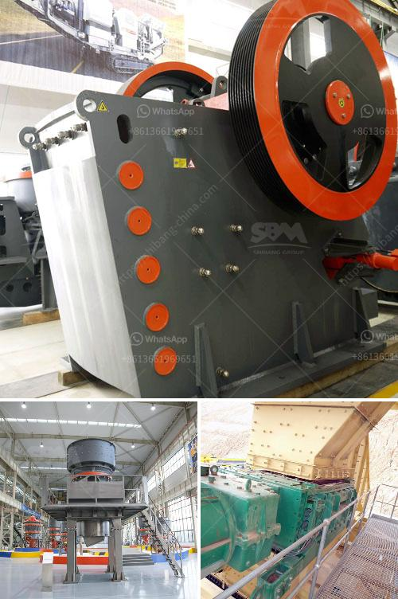

<h3>funding for establishment of stone crushers</h3>
Stone crushing industry is an important industrial sector in the country engaged in producing crushed stone of various sizes depending upon the requirement which acts as raw material for various construction activities such as construction of roads, highways, bridges, buildings, canals etc. It is estimated that there are over 12,000 stone crusher units in India. The number is expected to grow further keeping in view the future plans for development of infrastructure of roads, canals and buildings that are required for overall development of the country.

In India, the Stone Crushing Industry sector is estimated to have an annual turnover of Rs. 5000 crore and is therefore an economically important sector. The sector is estimated to be providing direct employment to over 500,000 people engaged in various activities such as mining, crushing plant, transportation of mined stones and crushed products etc. Most of these personnel are from rural and economically backward areas where employment opportunities are limited and therefore stone crushers are an important means of livelihood for them.

The demand for crushed stone will continue to grow with the growth of its user industry. The unit can be set up depending availability of raw material and major commercial center. Stone crushed by stone crusher is segregated into various sizes like 35mm, 20mm, 12mm, etc for different uses. The final product of stone crusher aggregates are used for construction of roads, bridges, housing, industrial building construction and other cement based products like RCC pipes, PSC poles, remolded slabs, frames and beams, etc for fabrication.

Stone aggregates are also used as raw material for other construction activities such as foundation drains, retaining walls, and other construction projects. The demand for crushed stone will continue to grow with the growth of its user industry. One of the most particular and general but most important materials used for making concrete is stone chips.

These are used as a road metaling and also as a raw material for cement making for construction works. Crushing is the process of transferring a force amplified by mechanical advantage through a material made of molecules that bond together more strongly, and resist deformation more than those in the material being crushed do.

Crushing devices hold material between two parallel or tangent solid surfaces, and apply sufficient force to bring the surfaces together to generate enough energy within the material being crushed so that its molecules separate from (fracturing), or change alignment in relation to (deformation), each other. The earliest crushers were hand-held stones, where the weight of the stone provided a boost to muscle power, used against a stone anvil.

The demand for crushed stone will continue to grow with the growth of its user industry. Investment and subsidy to establish stone crushers will have huge implications in the development of infrastructure of the country. It is recommended that the Department of Industries and Commerce should provide financial assistance to the stone crushing industry to enable them to set up stone crushers to meet the demands of the construction sector. This will also lead to employment generation and revenue to the government, thereby contributing to the overall development of the country. The funding for the establishment of stone crushers should also be linked to necessary environmental safeguards to ensure that the industry operates in an environmentally sustainable manner.
<h3>Contact us</h3><ul><li><strong>Whatsapp:&nbsp;<a href="https://wa.me/8613661969651">+8613661969651</a></strong></li><li><a href="https://swt.shibang-china.com/?git&amp;zhl&amp;funding for establishment of stone crushers"><strong>Online Service(chat now)</strong></a></li></ul><h3>Related</h3><ul><li><a href='25kg h high capacity grinder hammer milling machine.md'>25kg h high capacity grinder hammer milling machine</a></li><li><a href='limestone ball mill italy.md'>limestone ball mill italy</a></li><li><a href='price quarry stone crusher.md'>price quarry stone crusher</a></li><li><a href='3 pound ball mill in india.md'>3 pound ball mill in india</a></li><li><a href='belt conveyor indonesia.md'>belt conveyor indonesia</a></li></ul>