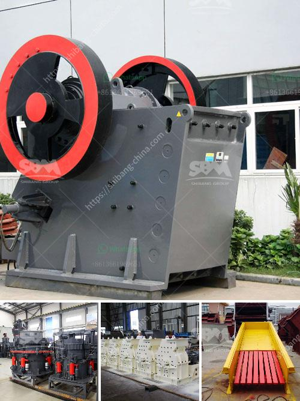

<h3>general hypothesis of jaw crusher</h3>
The development of jaw crushers is continuously progressing to meet the needs of various industries and applications. Jaw crushers have become indispensable tools in the quarrying industry, thanks to the unique features they possess.

An efficient and reliable jaw crusher is a vital asset for mining and quarrying operations. It is mainly used as a primary crusher for coarse crushing applications, but can also be used as a secondary crusher for medium-sized rocks. Based on years of experience and countless tests, manufacturers have developed a modern and reliable jaw crusher with several innovative features.

The general hypothesis of a jaw crusher revolves around the concept of using compressive force to break hard materials. This force is achieved by two jaw plates, one of which is stationary while the other reciprocates to create a squeezing motion. The material is fed into the crushing chamber and progressively crushed as it travels down the length of the chamber. The crushed material exits through the bottom of the crusher, resulting in a uniform product size.

One of the key advancements in modern jaw crushers is the overhead eccentric design. This design maximizes the stroke potential and provides better throughput capacity. It also ensures the uniform distribution of the crushing forces, leading to improved efficiency and reduced wear on the jaw plates. The overhead eccentric design is particularly beneficial for quarrying applications where high production rates are essential.

Another crucial aspect of jaw crusher design is the angle of the nip, which refers to the angle between the fixed jaw and the moving jaw during the crushing process. A steeper nip angle ensures a more aggressive bite and increases the capacity and efficiency of the crusher. However, a larger nip angle also results in increased wear on the jaw plates. Therefore, finding the optimum nip angle is essential for balancing performance and wear.

To enhance the performance and reliability of jaw crushers, manufacturers have introduced various technological advancements. One such advancement is the use of hydraulic systems to adjust the jaw crusher’s CSS (closed side setting). CSS refers to the smallest distance between the concave and the mantle, which determines the product size. Hydraulic systems provide quick and easy adjustments, reducing downtime and improving productivity.

Furthermore, jaw crushers now feature advanced safety mechanisms to protect operators from potential hazards. These safety features include automatic tramp release systems, which prevent damage to the crusher from uncrushable materials, and overload protection systems, which safeguard against excessive pressure or power overloads.

In conclusion, the general hypothesis of a modern jaw crusher revolves around using compressive force to crush hard materials efficiently and uniformly. Key design features include an overhead eccentric design, optimized nip angle, and advanced technological advancements such as hydraulic systems and safety mechanisms. With these innovations, jaw crushers have become reliable and efficient tools in the quarrying industry, ensuring high productivity and reducing downtime.
<h3>Contact us</h3><ul><li><strong>Whatsapp:&nbsp;<a href="https://wa.me/8613661969651">+8613661969651</a></strong></li><li><a href="https://swt.shibang-china.com/?git&amp;zhl&amp;general hypothesis of jaw crusher"><strong>Online Service(chat now)</strong></a></li></ul><h3>Related</h3><ul><li><a href='mineral materials crushers.md'>mineral materials crushers</a></li><li><a href='harga stone crusher 400 x 600 harga stone crusher.md'>harga stone crusher 400 x 600 harga stone crusher</a></li><li><a href='mobile dms copper concentrate machine.md'>mobile dms copper concentrate machine</a></li><li><a href='crushing  screening equipment.md'>crushing & screening equipment</a></li><li><a href='carbon grinding machine.md'>carbon grinding machine</a></li></ul>