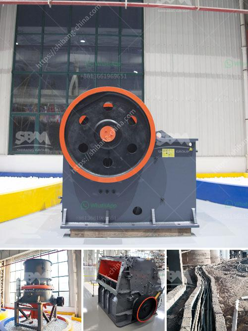

<h3>general layout of cement plant</h3>
The general layout of a cement plant starts with a quarry followed by a crushing and screening facility, raw material storage area, blending and homogenization process, clinker storage area, kiln feed preparation, coal grinding and storage, cement grinding and storage, and finally, packing and dispatch.

Quarrying is the initial stage where limestone and clay are blasted, extracted, and transported to the crushing and screening facility. This area is typically located near the quarry to minimize transportation costs.

The crushing and screening facility processes the raw materials into smaller sizes, ensuring they are suitable for the next stages of the cement manufacturing process. After crushing, the materials are transported to storage areas.

Blending and homogenization is a crucial step as it ensures the consistent chemical composition of the raw materials. The materials from different storage areas are mixed and homogenized to achieve a uniform mixture.

The homogenized mixture is then transported to the clinker storage area. This is where the material is stored before it enters the kiln. The clinker storage area usually consists of multiple storage silos to accommodate the production volume.

In the kiln feed preparation stage, the homogenized raw material mixture is further processed to achieve the desired chemical composition. The raw materials undergo a series of chemical reactions in the kiln to form clinker, the main ingredient in cement production.

Coal grinding and storage go hand in hand as coal is used as a fuel in the cement manufacturing process. The coal grinding facility pulverizes the coal into a fine powder, and it is stored in dedicated storage silos.

Cement grinding is the next crucial step to produce the final cement product. The clinker, together with additives such as gypsum and limestone, is ground to a fine powder in a cement mill. This grinding process occurs in a closed system, which reduces the energy consumption and environmental impact.

After grinding, the cement is stored in silos before final packaging and dispatch. The packing and dispatch area typically consists of bagging units, where the cement is packed into bags or bulk loaders where the cement is loaded into trucks or rail cars for transportation.

Overall, the general layout of a cement plant is designed to ensure the efficient, safe, and cost-effective production of cement. Each area of the plant plays a crucial role in the manufacturing process, from the quarry and crushing stages to the storage, grinding, and dispatch of the final product. By optimizing the layout and processes, cement plants aim to achieve maximum productivity and quality while minimizing environmental impacts.
<h3>Contact us</h3><ul><li><strong>Whatsapp:&nbsp;<a href="https://wa.me/8613661969651">+8613661969651</a></strong></li><li><a href="https://swt.shibang-china.com/?git&amp;zhl&amp;general layout of cement plant"><strong>Online Service(chat now)</strong></a></li></ul><h3>Related</h3><ul><li><a href='talc rock crusher.md'>talc rock crusher</a></li><li><a href='new trends in concrete technology slide presentation.md'>new trends in concrete technology slide presentation</a></li><li><a href='kaolin industry machine dhaka bangladesh.md'>kaolin industry machine dhaka bangladesh</a></li><li><a href='used iron ore jaw crusher price nigeria.md'>used iron ore jaw crusher price nigeria</a></li><li><a href='barite machinery production plant.md'>barite machinery production plant</a></li></ul>