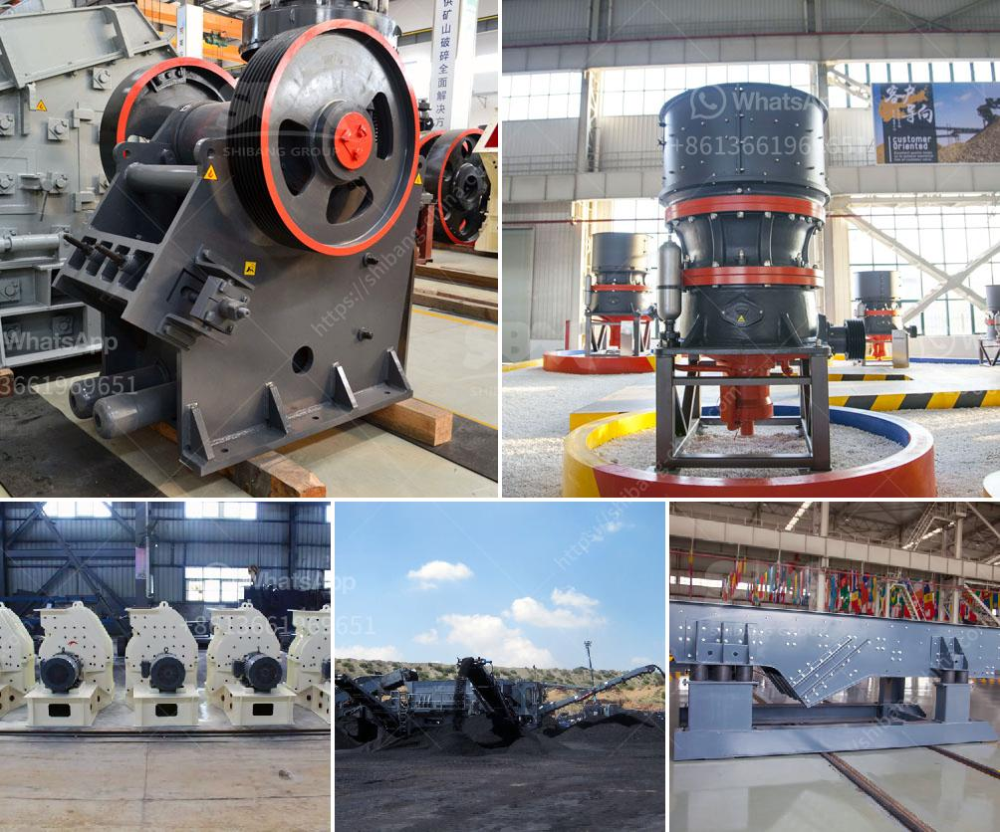

<h3>german made stone crushers</h3>
German Made Stone Crushers are a worthy investment for anyone looking to enhance their domestic or industrial construction efforts. Built to withstand the toughest tasks, these crushers can endure even the roughest of demolition materials, providing unrivaled reliability and durability in the process. Equipped with high-performance components and state-of-the-art technology, German-made stone crushers deliver optimum performance and ensure maximum efficiency in producing aggregates for various applications.

One of the key features of these crushers is their ability to crush rocks into different sizes with precision and accuracy. Whether it is limestone, granite, or any other type of stone, these crushers can easily break them down into the desired size. This feature is particularly beneficial for construction projects that require specific sizes of aggregate.

German-made stone crushers also prioritize the safety of operators and workers on-site. With advanced safety features such as overload protection and automatic lubrication, these crushers minimize the risk of accidents, ensuring a safer working environment. Additionally, the ergonomic design of these machines enables seamless operation, reducing operator fatigue and increasing productivity.

Aside from their high-quality construction and safety features, German-made stone crushers are also known for their low maintenance requirements. Designed to be robust and reliable, these crushers require minimal regular maintenance, saving time and resources in the long run.

Furthermore, German engineering ensures that these crushers are energy-efficient, contributing to lower operational costs and reduced carbon footprint. By utilizing advanced technology and optimizing power consumption, these crushers deliver excellent performance without compromising on sustainability.

German-made stone crushers have earned their reputation worldwide for their superior quality, performance, and reliability. Whether it is for small-scale projects or large-scale construction endeavors, these crushers are the go-to choice for professionals seeking exceptional crushing capabilities.

In summary, German-made stone crushers offer unparalleled performance, safety, and reliability. With their ability to crush stones into various sizes and their low maintenance requirements, these crushers are the ideal investment for any construction project. By choosing German-made stone crushers, individuals and industries can enjoy the peace of mind that comes with quality machinery, ultimately enhancing their construction efforts.
<h3>Contact us</h3><ul><li><strong>Whatsapp:&nbsp;<a href="https://wa.me/8613661969651">+8613661969651</a></strong></li><li><a href="https://swt.shibang-china.com/?git&amp;zhl&amp;german made stone crushers"><strong>Online Service(chat now)</strong></a></li></ul><h3>Related</h3><ul><li><a href='quarry equipment sale in usa.md'>quarry equipment sale in usa</a></li><li><a href='mobile impact crusher for sale.md'>mobile impact crusher for sale</a></li><li><a href='limestone powder production process.md'>limestone powder production process</a></li><li><a href='price for cone crusher.md'>price for cone crusher</a></li><li><a href='new small gold processing equipment for sale in usa.md'>new small gold processing equipment for sale in usa</a></li></ul>