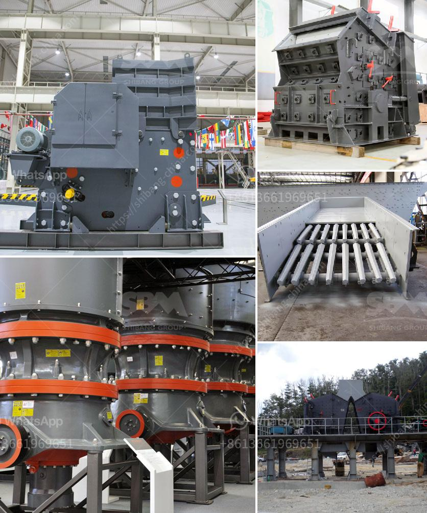

<h3>gold crusher for sale in turkey</h3>
When it comes to the mining industry, one of the most valuable and sought-after minerals is gold. Gold has been used for centuries as a form of currency, a symbol of wealth and power, and a coveted asset. Turkey, known for its rich cultural heritage and historical significance, is also a significant player in the gold mining sector. As a result, there is a constant demand for efficient gold crushers for sale in Turkey.

A gold crusher is a machine designed to reduce large rocks into smaller rocks, gravel, or rock dust. Crushers may be used to reduce the size, or change the form, of waste materials so they can be more easily disposed of or recycled, or to reduce the size of a solid mix of raw materials (as in rock ore), so that pieces of different composition can be differentiated.

In Turkey, there are numerous gold mines that require the use of crushers to extract the precious metal. These crushers are often used to break down the ores into smaller sizes and facilitate the extraction process. They are also utilized to crush rocks and stones for various construction purposes.

The gold crusher for sale in Turkey is often utilized by mining companies to process raw materials into smaller pieces for further processing. This device is known for its powerful crushing ability, ensuring efficient and high-quality ore extraction. With advancements in technology, these crushers have become even more versatile, capable of handling various materials and delivering consistent results.

With the growing demand for gold and the numerous mining projects in Turkey, the need for efficient and reliable gold crushers for sale has never been higher. Mining companies in the region are constantly seeking cutting-edge equipment to maximize their productivity and extract gold in an efficient and cost-effective manner.

In conclusion, the gold crusher plays a crucial role in the Turkish mining industry. With its ability to efficiently crush rocks and ores, it enables mining companies to extract gold and contribute to the country's economy. As technology continues to advance, these crushers are becoming even more effective and reliable. Thus, the demand for high-quality gold crushers for sale in Turkey is expected to remain strong in the coming years.
<h3>Contact us</h3><ul><li><strong>Whatsapp:&nbsp;<a href="https://wa.me/8613661969651">+8613661969651</a></strong></li><li><a href="https://swt.shibang-china.com/?git&amp;zhl&amp;gold crusher for sale in turkey"><strong>Online Service(chat now)</strong></a></li></ul><h3>Related</h3><ul><li><a href='gypsum factory in pakistan.md'>gypsum factory in pakistan</a></li><li><a href='ton per jam jaw crusher.md'>ton per jam jaw crusher</a></li><li><a href='zircon sand production line price.md'>zircon sand production line price</a></li><li><a href='iron ore machine process.md'>iron ore machine process</a></li><li><a href='how to separate gold from sand with machine.md'>how to separate gold from sand with machine</a></li></ul>