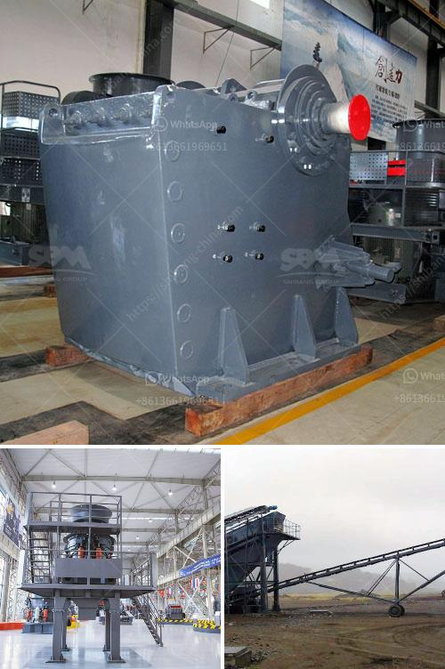

<h3>gold crushing machine price in usa</h3>
Gold ore plays a crucial role in the economic development of any country. Gold is a rare, precious metal that is used in various industries such as jewelry, electronics, medicine, and dentistry. Since gold is an important financial asset, it is also used as a hedge against inflation and currency fluctuations. As a result, the demand for gold is constantly high, driving the need for gold crushing machines.

The price of gold crushing machine in the USA is a complex topic because it involves multiple factors that influence the price. The cost of gold crushing machine is influenced by various aspects such as the size of the machine, the raw materials used to manufacture the machine, the level of automation, the quality and durability of the machine, and the reputation of the manufacturer.

The size of the gold crushing machine plays a crucial role in determining its price. Generally, larger machines are more expensive than smaller ones due to the higher manufacturing and operating costs associated with them. Larger machines also tend to have higher processing capacities, which makes them more efficient and productive. However, the size of the machine should be chosen based on the specific requirements of the user.

The raw materials used to manufacture the gold crushing machine have a significant impact on its price. Machines made from high-quality materials such as steel tend to be more expensive than those made from lower-quality materials. The choice of raw materials also affects the durability and reliability of the machine. A well-constructed machine built with superior raw materials is likely to last longer and require fewer repairs, making it a cost-effective investment in the long run.

Automation is another factor that affects the price of gold crushing machines. Machines that are fully automated and require minimal human intervention are generally more expensive than machines that rely on manual operation. Automation increases efficiency, reduces labor costs, and improves safety. Therefore, machines with higher levels of automation tend to have a higher price tag.

The quality and durability of the machine are crucial considerations when determining its price. A high-quality machine that is built to withstand heavy-duty crushing operations is likely to have a higher price compared to a machine of lower quality. It is essential to invest in a machine that will perform reliably and consistently over an extended period to ensure maximum productivity and return on investment.

Finally, the reputation of the manufacturer also influences the price of gold crushing machines. Well-established and reputable manufacturers who have a track record of producing high-quality machines tend to charge higher prices for their products. However, opting for a machine from a trusted manufacturer ensures that you are getting a reliable, efficient, and durable machine.

In conclusion, the price of gold crushing machines in the USA is influenced by various factors. These include the size of the machine, the raw materials used, the level of automation, the quality and durability of the machine, and the reputation of the manufacturer. It is important to consider all these factors and choose a machine that best suits your specific needs and budget. Investing in a high-quality gold crushing machine is a wise decision as it ensures optimal production and long-term cost savings.
<h3>Contact us</h3><ul><li><strong>Whatsapp:&nbsp;<a href="https://wa.me/8613661969651">+8613661969651</a></strong></li><li><a href="https://swt.shibang-china.com/?git&amp;zhl&amp;gold crushing machine price in usa"><strong>Online Service(chat now)</strong></a></li></ul><h3>Related</h3><ul><li><a href='used rock crushers for sale in germany.md'>used rock crushers for sale in germany</a></li><li><a href='closs size setting jaw crusher.md'>closs size setting jaw crusher</a></li><li><a href='conveyor belt manufactuer zimbabwe.md'>conveyor belt manufactuer zimbabwe</a></li><li><a href='mobile coal screen units south africa.md'>mobile coal screen units south africa</a></li><li><a href='zimbabwe mobile crusher rentals.md'>zimbabwe mobile crusher rentals</a></li></ul>