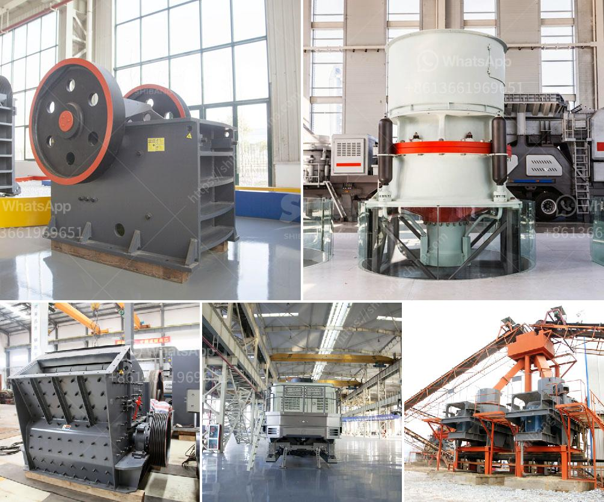

<h3>gold crushing plant</h3>
Gold mining is a lucrative industry that has provided employment opportunities and enriched economies globally. To extract gold from the earth, various methods are employed, with crushing being an integral part of the extraction process. In this article, we will explore the importance of gold crushing plants and how they contribute to the overall mining operation.

A gold crushing plant is a specialized facility used to break large gold-bearing rocks into smaller pieces. These rocks are then further processed to extract the valuable gold metal. The crushing process typically consists of a primary crusher followed by secondary and tertiary crushers. The primary crusher reduces the large rocks into smaller manageable sizes, while the secondary and tertiary crushers further refine the material to the desired size.

One of the main reasons for crushing gold-bearing rocks is to increase the surface area available for the extraction process. Gold occurs in minute particles within the rock, making it difficult to separate from the surrounding material. By crushing the rocks, the gold particles become more exposed, allowing for a more efficient extraction process.

The gold crushing plant plays a vital role in the entire gold mining process. It not only breaks down the gold-bearing rocks into smaller sizes but also prepares them for further processing. The crushed material is fed into a gold mill, where the ore is ground further to finely separate the gold from the surrounding rock. This grinding process is essential to release the gold particles from the host material, making it easier to extract using other techniques such as gravity separation or chemical leaching.

In addition to enhancing the extraction process, gold crushing plants also contribute to environmental sustainability. Mining operations can have a significant impact on the environment, particularly in terms of soil erosion, water pollution, and habitat destruction. However, modern gold crushing plants are equipped with various technologies to mitigate these environmental impacts. For example, dust extraction systems are used to minimize air pollution, and water recycling systems are implemented to reduce water usage and pollution.

Furthermore, gold crushing plants are often designed to be modular and easily transportable. This flexibility allows mining companies to move their crushing plants to different locations within a mining site or between different mining sites. This mobility is particularly useful in large-scale mining operations where the gold-bearing ore may be spread across a wide area.

In conclusion, gold crushing plants are essential in the gold mining industry. They break down the large rocks into smaller pieces, increasing the surface area available for gold extraction. Additionally, these plants enable the extraction process to be more efficient and environmentally friendly. Their modular design and mobility provide flexibility for mining companies to adapt to different operational needs. As the demand for gold continues to rise, the importance of well-equipped and efficient gold crushing plants cannot be overstated.
<h3>Contact us</h3><ul><li><strong>Whatsapp:&nbsp;<a href="https://wa.me/8613661969651">+8613661969651</a></strong></li><li><a href="https://swt.shibang-china.com/?git&amp;zhl&amp;gold crushing plant"><strong>Online Service(chat now)</strong></a></li></ul><h3>Related</h3><ul><li><a href='300tpd cement plant cost in india.md'>300tpd cement plant cost in india</a></li><li><a href='gypsum production powder manufacturers in europe.md'>gypsum production powder manufacturers in europe</a></li><li><a href='industrial impact crushers.md'>industrial impact crushers</a></li><li><a href='business plan for gold mining company in zimbabwe.md'>business plan for gold mining company in zimbabwe</a></li><li><a href='ton day cement clinker grinding plant.md'>ton day cement clinker grinding plant</a></li></ul>