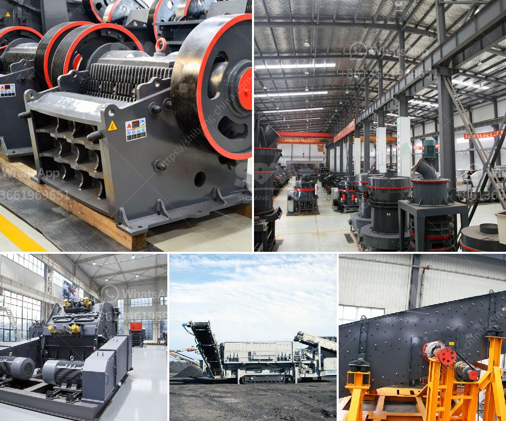

<h3>gold mining equipment mobile plant</h3>
Gold mining has been a traditional activity in many parts of the world. Nowadays, the demand for gold has steadily increased, as more and more people are realizing its lucrative potential. Hence, gold mining expeditions have become more prevalent, with miners searching for the precious metal in various locations.

One crucial component of a successful gold mining operation is the equipment used. A modern approach to gold mining equipment mobile plants is by utilizing a mobile wash plant. With independent trommel scrubbers as well as a vibrating screen, these plants provide a high level of cleanliness to help achieve maximum gold recovery.

A gold mining equipment mobile plant is a compact and portable wash plant that can be easily moved from one location to another, minimizing setup time and ensuring optimal efficiency. This plant can be used in various terrains, as it allows miners to quickly and easily process concentrate, avoiding the need for expensive infrastructure or time-consuming permits. Furthermore, its compact size allows for easier transportation, reducing logistical challenges.

The mobile plant consists of multiple components, each with its own unique function. The trommel scrubber, the primary component, aids in the washing process by breaking down sticky clay and freeing up the gold particles. Its rotating motion ensures thorough cleaning, allowing for better gold recovery rates.

The vibrating screen, on the other hand, helps to separate the washed material into different sizes. It removes oversized material, ensuring that only the desired sized particles proceed for further processing. This step helps achieve better concentration and ultimately higher gold recovery rates.

The gold mining equipment mobile plant is also equipped with a water pump and generator, ensuring a constant supply of water and power. This feature is especially crucial in remote areas where access to utilities may be limited. With these auxiliary components, miners can efficiently process large volumes of material without any interruptions.

One of the key advantages of a gold mining equipment mobile plant is its versatility. It can be used in various types of gold deposits, such as alluvial or placer deposits. These deposits are usually found near water bodies, such as rivers or streams, and the mobile plant's portability allows miners to set up operations near these abundant sources. The plant can also be used in other mining operations, such as hard rock mining, where the gold is embedded in rocks and requires crushing and grinding before extraction.

In conclusion, a gold mining equipment mobile plant is a valuable tool for modern gold miners. Its compact and portable design, coupled with its efficient washing and screening capabilities, ensures maximum gold recovery rates. The versatility and ease of transportation make it suitable for various mining environments, including remote locations. With the aid of a mobile plant, gold mining operations can be more efficient, cost-effective, and environmentally friendly.
<h3>Contact us</h3><ul><li><strong>Whatsapp:&nbsp;<a href="https://wa.me/8613661969651">+8613661969651</a></strong></li><li><a href="https://swt.shibang-china.com/?git&amp;zhl&amp;gold mining equipment mobile plant"><strong>Online Service(chat now)</strong></a></li></ul><h3>Related</h3><ul><li><a href='small stones to building sand crusher.md'>small stones to building sand crusher</a></li><li><a href='sand manufacturing small scale.md'>sand manufacturing small scale</a></li><li><a href='marble crusher equipment.md'>marble crusher equipment</a></li><li><a href='vibrating grizzly feeder 35 ton per jam.md'>vibrating grizzly feeder 35 ton per jam</a></li><li><a href='quarry crusher equipment manufacturer in germany.md'>quarry crusher equipment manufacturer in germany</a></li></ul>