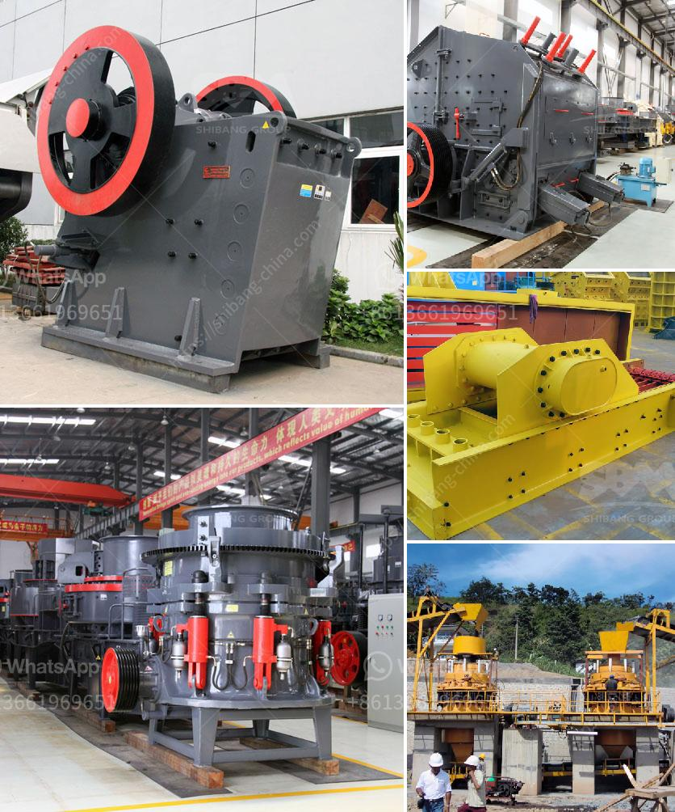

<h3>gold mining project cost</h3>
Gold mining is a lucrative undertaking that has been practiced for centuries. It involves extracting the precious metal from the earth in order to purify and sell it for profit. However, like any business venture, gold mining projects require careful planning and financial investment to be successful. The cost of a gold mining project can vary greatly depending on several factors.

One of the primary determinants of project cost is the scale of the mining operation. Small-scale mining projects generally require less capital investment and have lower operating costs. These projects typically involve a small team of workers using basic tools and equipment to extract gold from shallow deposits. The cost of setting up a small-scale mine may range from a few thousand dollars to several hundred thousand dollars, depending on the size and location of the deposit.

On the other hand, large-scale gold mining projects involve significant capital investments. These projects require substantial funding to cover the cost of acquiring and developing mining concessions, purchasing heavy machinery, constructing facilities, and hiring a large workforce. The total cost of a large-scale project can range from a few million to several billion dollars, depending on the size of the operation and the complexity of the mining processes involved.

Another factor that affects project cost is the geology of the area being mined. Gold deposits can be found in various types of geological formations, such as alluvial deposits, hard rock veins, and deep underground ore bodies. The cost of mining can vary depending on the type of deposit and the method used to extract gold. For example, alluvial deposits can be relatively easy and inexpensive to mine, as they involve simple surface excavations. On the other hand, extracting gold from deep underground ore bodies can be more challenging and costly, as it often requires extensive drilling, blasting, and underground infrastructure.

Infrastructure and logistical considerations also contribute to the overall cost of a gold mining project. Access to the mining site, availability of water for processing, and energy sources for powering the mining equipment all need to be considered. In some remote areas, establishing the necessary infrastructure and securing reliable transportation routes can significantly add to the project cost.

Furthermore, environmental compliance and sustainability efforts are becoming increasingly important factors in the cost of gold mining projects. Governments and regulatory bodies are imposing stricter environmental regulations on mining operations, which can result in additional expenses for monitoring and remediation. Moreover, companies are now recognizing the importance of sustainable mining practices and are investing in technologies and processes that minimize the environmental impact of their operations. These initiatives, while beneficial in the long run, can also add to the upfront cost of a gold mining project.

In conclusion, the cost of a gold mining project can vary significantly depending on the size, location, geology, and infrastructure requirements of the operation. Small-scale projects generally require less investment, while large-scale operations can involve substantial capital expenditures. Factors such as the type of deposit being mined, accessibility, and environmental compliance also contribute to project costs. It is crucial for investors and mining companies to carefully assess and plan for these factors to ensure the profitability and sustainability of their gold mining projects.
<h3>Contact us</h3><ul><li><strong>Whatsapp:&nbsp;<a href="https://wa.me/8613661969651">+8613661969651</a></strong></li><li><a href="https://swt.shibang-china.com/?git&amp;zhl&amp;gold mining project cost"><strong>Online Service(chat now)</strong></a></li></ul><h3>Related</h3><ul><li><a href='vertical shaft impact crusher design.md'>vertical shaft impact crusher design</a></li><li><a href='operation of stone crushing plant.md'>operation of stone crushing plant</a></li><li><a href='vibrating screen feeder.md'>vibrating screen feeder</a></li><li><a href='stone crusher plant price in india.md'>stone crusher plant price in india</a></li><li><a href='dolomite ball mill price.md'>dolomite ball mill price</a></li></ul>