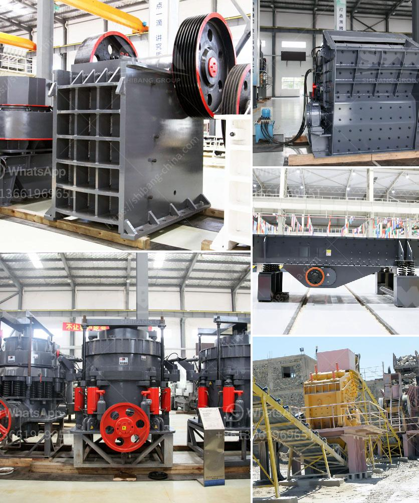

<h3>gold ore crusher machine</h3>
Gold ore crusher machine is a specialized equipment for processing gold ore. It is mainly used for crushing and grinding gold ore into small particles. This machine is widely used in various industries such as mining, metallurgy, building materials, highway, railway, water conservancy and chemical industries.

There are two important components in gold ore crusher machine, namely the crushing chamber and the moving jaw. The crushing chamber is made up of a fixed jaw plate and a mobile jaw plate. When the machine is working, the two jaw plates squeeze and crush the materials between them. The crushed materials are discharged from the bottom of the crushing chamber.

The moving jaw of the gold ore crusher machine not only moves back and forth, but also has a certain swing angle. This swinging motion is mainly achieved by the eccentric shaft. The eccentric shaft is driven by the motor through the V-belt, so that the moving jaw reciprocates along a predetermined trajectory. This swinging motion not only increases the production capacity of the machine, but also ensures the uniformity of the crushed materials.

The gold ore crusher machine has the advantages of simple structure, easy operation, reliable operation and low energy consumption. It can process gold ore with a particle size of 10-350mm and a production capacity of 5-800 tons per hour. It has been widely used in metallurgy, mining, building materials, roads, railways, water conservancy and chemical industries.

In addition, the gold ore crusher machine has the advantages of low maintenance cost, small footprint, low investment cost and high return on investment. It is an ideal choice for small and medium-sized enterprises to invest in the field of gold ore processing.

To ensure the normal operation of the gold ore crusher machine, regular maintenance and repair are necessary. The lubrication of the bearings, the adjustment of the discharge port and the replacement of the vulnerable parts are all important tasks in the maintenance process. Timely maintenance can not only extend the service life of the machine, but also improve the processing efficiency and reduce the production cost.

In conclusion, the gold ore crusher machine is a specialized equipment for processing gold ore. It has the advantages of simple structure, easy operation, low energy consumption and high efficiency. It is widely used in various industries such as mining, metallurgy, building materials, highway, railway, water conservancy and chemical industries. With the continuous development of technology, the gold ore crusher machine will become more efficient, reliable and energy-saving, and will bring greater benefits to the gold ore processing industry.
<h3>Contact us</h3><ul><li><strong>Whatsapp:&nbsp;<a href="https://wa.me/8613661969651">+8613661969651</a></strong></li><li><a href="https://swt.shibang-china.com/?git&amp;zhl&amp;gold ore crusher machine"><strong>Online Service(chat now)</strong></a></li></ul><h3>Related</h3><ul><li><a href='stone crusher machine in south africa.md'>stone crusher machine in south africa</a></li><li><a href='cone crushers supplier mining.md'>cone crushers supplier mining</a></li><li><a href='rock stone milling machine.md'>rock stone milling machine</a></li><li><a href='nigeria stone crusher.md'>nigeria stone crusher</a></li><li><a href='quick lime powder making machine.md'>quick lime powder making machine</a></li></ul>