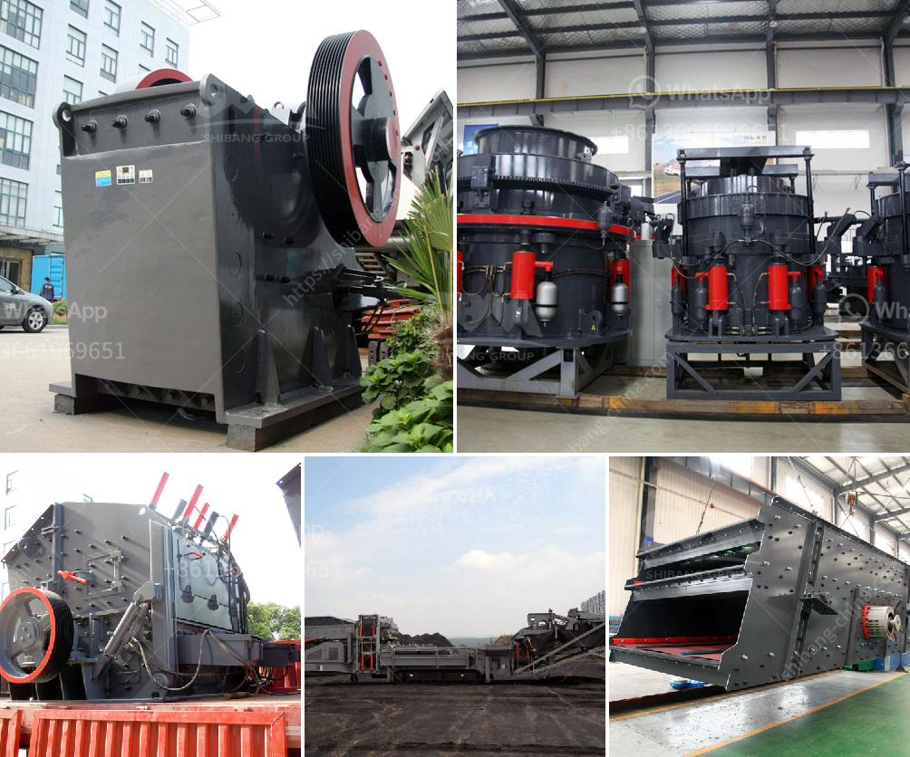

<h3>gold ore crushing machine</h3>
Gold ore mining equipment is popular required in Africa for gold ore mining plants, Kefid has small capacity and small invest mining machines, which can suitable for small gold mine mining and crushing. Kefid China is the professional small scale gold ore mining equipment manufacturer and exports. Kefid small scale gold ore mining equipment have been used in all over the world, such as Nigeria, Ghana, Tanzania, South Africa, Zimbabwe etc.

Usually, in small scale gold ore, equipment used from mining equipment to the all beneficiation processing line are blasting, transmission, feeding, crushing, conveying, grinding, extracting (flotation, magnetic separation, electrostatic ore dressing, mix mercury and chemical method).

We will pursue quality, reputation first, the principle of quality service and provide the best and the most energy saving, high quality small scale gold mining processing equipment.

1. Crushing process mainly used in the gold ore screening & crushing machinery: jaw crusher, cone crusher, gold sieve and so on.

3. Gold ore Separating Processing machinery: Gold ore separating recycling processing machine, mercury amalgamator and etc.

4. Gold ore Concentrating Process: Concentrating table or shaking table, centrifugal separator. It mainly composed by concentrating chute, shaking chute, discharging chute, chassis, comb feeder, water tanks, rifle spokes and lubrication system.

5. For small scale gold mining equipment in Congo, the processing capacity is to 400 tons per hour. Our ore processing equipment are including standard layout, wet screen, desliming hopper, double rotary screen 3 sets, cone crushers.

With the progress of mining crushing industry and the concept of national energy saving, the current market demand of energy-saving and environmental protection, and the small-scale gold ore dressing company developed rapidly, promoting the development of its industry.

In the last century, the working principle of small-scale gold ore mining equipment is very good, and the quality standards are extremely high. But after years of experience accumulation, small-scale gold ore mining equipment has been widely used, and mature, which can meet the needs of mining enterprises for daily production.

Suspension roller type gold ore crushing machine is mainly used to suppress the sticky material, in the ore; it is mainly used for grinding operations before the sorting operation, so as to improve the sorting operation index. It is suitable for materials with water content less than 85% and compressive strength less than 100 mpa.

The working principle of the gold ore crusher is: first, the gold ore is fed into the hopper by the loader, and then transported to the crusher by the vibrating feeder, and the crushing machine breaks the large-sized material into small-sized material, and then breaks through the first stage and second stage crushing. The machine sand enters the third stage fine crushing, and the finished product particle size is less than 8mm.

Gold ore beneficiation plant uses gold ore from the mine site having a particle size of 0-100mm and including a sulfide mine to determine the sulfide flotation method. Use flotation sulfide ores to enrich gold and silver-containing sulfide minerals. The object is to eliminate harmful impurities, recover low-grade ores and improve ore recovery rate.

In summary, gold ore dressing equipment basically includes crushing, grinding, grading, stirring, magnetic separation, flotation and other equipment. Otherwise, according to the site conditions, Kefid can customize gold ore mining equipment production line.
<h3>Contact us</h3><ul><li><strong>Whatsapp:&nbsp;<a href="https://wa.me/8613661969651">+8613661969651</a></strong></li><li><a href="https://swt.shibang-china.com/?git&amp;zhl&amp;gold ore crushing machine"><strong>Online Service(chat now)</strong></a></li></ul><h3>Related</h3><ul><li><a href='bentonite clay processing production line supplier.md'>bentonite clay processing production line supplier</a></li><li><a href='cone crusher supply.md'>cone crusher supply</a></li><li><a href='coal grinding mill in india.md'>coal grinding mill in india</a></li><li><a href='price for cone crusher.md'>price for cone crusher</a></li><li><a href='stone crushing plant for sale in south africa.md'>stone crushing plant for sale in south africa</a></li></ul>