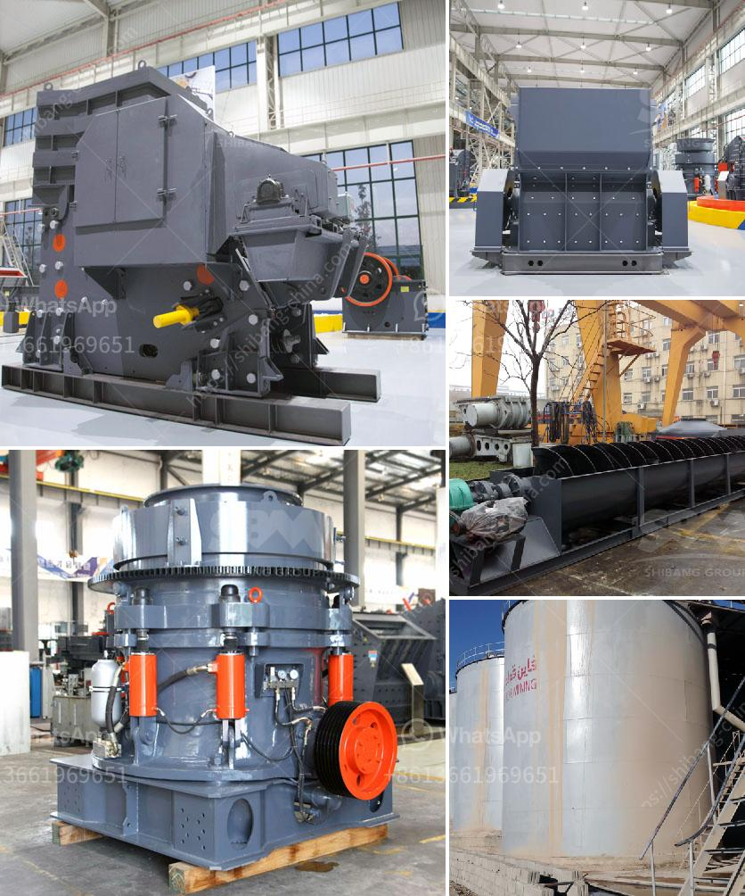

<h3>gold ore hammer mills that are diesel driven</h3>
Gold ore hammer mills are diesel driven machines that crush material with the help of hammers. The hammer mill uses a series of hammers to crush the material into smaller pieces, allowing for easy processing of gold-containing ore. The gold ore hammer mill operates on a diesel engine that helps provide power for the mill using fuel.

The gold ore hammer mill is portable and can be easily transported from one location to another, making it suitable for small-scale miners. The mill has a capacity of milling 2-3 tonnes of gold ore per hour and has a 30 horsepower engine. Diesel-powered grain mills are common in rural areas where access to electricity is limited.

One of the advantages of using diesel-powered gold ore hammer mills is its low operating costs. The diesel engine used in the mill requires less maintenance, and diesel fuel is generally more affordable compared to electricity. This makes it an economical choice for many small-scale gold miners who are operating on a limited budget.

In addition to being cost-effective, gold ore hammer mills that are diesel-driven are also efficient in processing gold ore. The powerful hammers crush the ore into smaller particles, which are then separated and processed to extract the gold. The efficiency of the hammer mill is crucial in reducing the amount of time and effort required for gold extraction.

Furthermore, using gold ore hammer mills that are diesel-driven helps mitigate the environmental impact of gold mining. Diesel engines are known for their lower carbon emissions compared to other types of engines. This means that using diesel-powered mills in the mining process contributes to a greener and more sustainable approach to gold extraction.

However, there are some limitations to using gold ore hammer mills that are diesel-driven. The mills require regular fuel refills, which can be an inconvenience, especially in remote areas where diesel fuel may not be readily available. Additionally, diesel engines can be noisy and produce vibrations, making it necessary to ensure the mill is properly anchored to minimize disruptions.

In conclusion, gold ore hammer mills that are diesel-driven are an efficient, cost-effective, and environmentally friendly option for small-scale gold miners. The ability to transport the mill easily from one location to another, combined with its low operating costs and efficient gold extraction process, make it a valuable tool for those looking to process gold ore efficiently. However, it is important to consider the limitations of diesel-powered mills, such as fuel availability and noise, before making a decision. Nonetheless, these mills continue to play a significant role in the gold mining industry, enabling miners to extract valuable gold from ore efficiently.
<h3>Contact us</h3><ul><li><strong>Whatsapp:&nbsp;<a href="https://wa.me/8613661969651">+8613661969651</a></strong></li><li><a href="https://swt.shibang-china.com/?git&amp;zhl&amp;gold ore hammer mills that are diesel driven"><strong>Online Service(chat now)</strong></a></li></ul><h3>Related</h3><ul><li><a href='conveyor belting manufacturers.md'>conveyor belting manufacturers</a></li><li><a href='sand manufacturing small scale.md'>sand manufacturing small scale</a></li><li><a href='gypsum plasterboard manufacturing process.md'>gypsum plasterboard manufacturing process</a></li><li><a href='quick lime hammer crusher.md'>quick lime hammer crusher</a></li><li><a href='almond sand stone crusher price.md'>almond sand stone crusher price</a></li></ul>