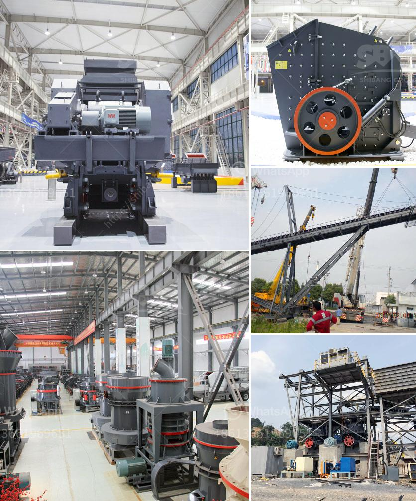

<h3>gold processing leaching plant</h3>
Gold processing leaching plant is an essential piece of equipment for mining companies. Utilized to extract gold from ores, the leaching process is efficient, cost-effective, and yields high-quality gold.

The plant consists of several components, including a crushing circuit, which serves as the first step in the gold extraction process. Here, the ore is finely ground to reduce its size and allow for maximum gold recovery. The finely ground ore is then transferred to a leaching tank, where a chemical solution is applied. This solution, known as a leaching agent, or leachate, is a mixture of water and various chemicals that accelerate the gold dissolution process.

The leaching agent acts upon the ore, dissolving the gold into a solution. This solution, called the pregnant solution, is then collected and sent to a separate tank. In this tank, gold recovery takes place via a process called carbon adsorption. Activated carbon is introduced into the tank, where it adsorbs the gold from the pregnant solution.

The loaded carbon is then transferred to an elution column, where the gold is stripped from the carbon using a hot caustic solution. The gold, now in its pure form, is collected as a sludge and sent to the gold smelting plant for further processing.

The spent carbon, devoid of gold, is rejuvenated using a thermal reactivation process, making it reusable for future gold adsorption cycles. This makes the gold processing leaching plant a sustainable and cost-effective solution for mining companies.

In conclusion, the gold processing leaching plant plays a crucial role in gold extraction from ore. Its efficient and environmentally friendly processes allow for high-quality gold recovery. With the ability to recycle and reuse materials, the plant ensures a sustainable approach to gold mining, benefiting both the industry and the environment.
<h3>Contact us</h3><ul><li><strong>Whatsapp:&nbsp;<a href="https://wa.me/8613661969651">+8613661969651</a></strong></li><li><a href="https://swt.shibang-china.com/?git&amp;zhl&amp;gold processing leaching plant"><strong>Online Service(chat now)</strong></a></li></ul><h3>Related</h3><ul><li><a href='raymond mill mumbai and kolkata.md'>raymond mill mumbai and kolkata</a></li><li><a href='quartz ball for ball mill.md'>quartz ball for ball mill</a></li><li><a href='gypsum factory in ethiopia.md'>gypsum factory in ethiopia</a></li><li><a href='hammer mills semarang.md'>hammer mills semarang</a></li><li><a href='roller crusher company.md'>roller crusher company</a></li></ul>