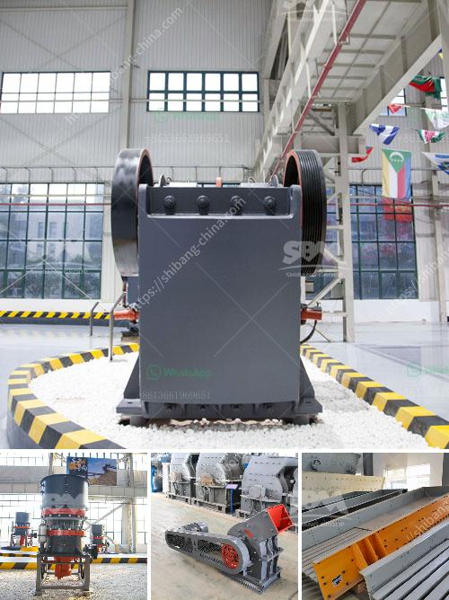

<h3>gold stamp mill for sale in china</h3>
Gold stamp mill, also known as Amalgamation Gold Extraction Machine, is one of the traditional mining equipment used in African and American countries for gold ore extraction. It is the key tool for the mining industry to crush and grind gold-bearing rocks for further processing. Generally, the gold stamp mill consists of a set of heavy steel stamps that are arranged in a wooden frame and are operated through a mechanized system.

In recent years, with the increasing demand for gold in China, more and more investors have shown great interest in purchasing gold stamp mills from China. There are several reasons why China has become a popular destination for gold stamp mill seekers. Firstly, China is one of the largest gold-producing countries in the world, with abundant gold resources. This ensures a steady supply of gold-bearing rocks for stamp milling operations.

Secondly, Chinese manufacturers have a long history of producing high-quality mining equipment at competitive prices. Chinese stamp mill manufacturers not only provide reliable machines but also offer excellent after-sales service and technical support. This makes it easier for buyers to operate and maintain their stamp mills, ensuring a smooth and efficient gold extraction process.

Moreover, the advanced technology and innovative design employed by Chinese manufacturers have greatly improved the efficiency and performance of stamp mills. With features such as high crushing ratio, large capacity, and low energy consumption, these stamp mills are capable of processing a large amount of ore within a short period, maximizing gold extraction efficiency.

To conclude, the availability of gold stamp mills for sale in China has attracted the attention of global gold mining investors. The rich gold resources and convenient access to high-quality mining equipment make China a leading destination for gold stamp mill purchase. With continuous technological advancements, Chinese stamp mills offer efficient and reliable gold extraction solutions for the mining industry.
<h3>Contact us</h3><ul><li><strong>Whatsapp:&nbsp;<a href="https://wa.me/8613661969651">+8613661969651</a></strong></li><li><a href="https://swt.shibang-china.com/?git&amp;zhl&amp;gold stamp mill for sale in china"><strong>Online Service(chat now)</strong></a></li></ul><h3>Related</h3><ul><li><a href='mobile crushers zenith.md'>mobile crushers zenith</a></li><li><a href='small stones to building sand crusher.md'>small stones to building sand crusher</a></li><li><a href='quarry crusher plant.md'>quarry crusher plant</a></li><li><a href='cost of crusher machine kenya.md'>cost of crusher machine kenya</a></li><li><a href='turkey jaw crushers in istanbul.md'>turkey jaw crushers in istanbul</a></li></ul>