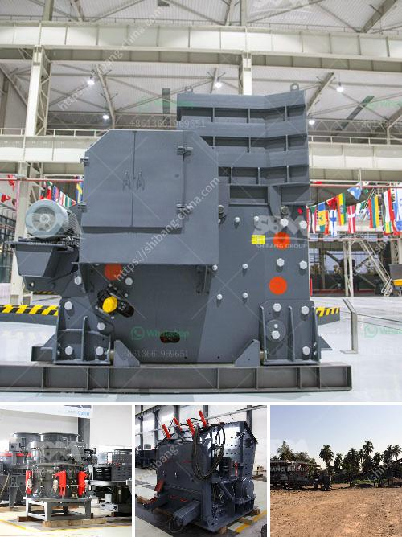

<h3>gold stone crusher and separator</h3>
Gold stone crusher and separator is one of the widely used mining equipment in the early stages. It is suitable for crushing and separating gold ore materials. This gold stone crusher and separator consists of a crushing chamber, a rotor, a hammer, a counter lining plate, a sieve plate, and other components. The hammer shaft is supported by several bearings and mounted on the crusher frame. The rotor is driven by a motor through a belt drive system and rotates at high speed. When the materials are fed into the crushing chamber, they are crushed by the high-speed rotating hammer and then thrown onto the counter lining plate for further crushing. 

The crushed materials will pass through the sieve plate and be discharged from the bottom of the crusher. The size of the final product can be adjusted by changing the sieve plate with different mesh sizes. This gold stone crusher and separator is suitable for crushing and grinding various gold ore materials. With the hardness less than 9.3 in Moh's scale and humidity less than 6%, this stone crusher and separator can be widely used in crushing and grinding gold ores into powder.

In gold mining industry, the conveying system plays a vital role. Gold stone crusher and separator are equipped with large and sturdy belts that are driven by pulling motors. While the gold stone crusher and separator comes with a metal detector on the feeding system to avoid accidental damage to the cone crusher. They have been built to withstand tough operating conditions and are suitable for crushing and separating various gold ores.

In summary, gold stone crusher and separator is a valuable equipment for processing gold ore. It is mainly used to separate gold from the impurities that surround it, thus ensuring higher-quality gold. It can also be used for the crushing and grinding of various gold ores in the gold mining industry. With its high efficiency and large capacity, it has become a popular choice among gold mining companies.
<h3>Contact us</h3><ul><li><strong>Whatsapp:&nbsp;<a href="https://wa.me/8613661969651">+8613661969651</a></strong></li><li><a href="https://swt.shibang-china.com/?git&amp;zhl&amp;gold stone crusher and separator"><strong>Online Service(chat now)</strong></a></li></ul><h3>Related</h3><ul><li><a href='cost of limestone crusher plant.md'>cost of limestone crusher plant</a></li><li><a href='rock stone milling machine.md'>rock stone milling machine</a></li><li><a href='sand washing plant for sale in south africa.md'>sand washing plant for sale in south africa</a></li><li><a href='crusher manufacturers turkey.md'>crusher manufacturers turkey</a></li><li><a href='contact list of mining companies in germany.md'>contact list of mining companies in germany</a></li></ul>