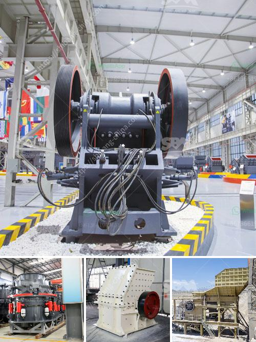

<h3>gold wash plant for sale canada</h3>
Canada is known for its vast gold reserves, making it an attractive country for mining operations. However, extracting gold from the ground is a time-consuming and expensive process, so many gold miners are turning to innovative technology to streamline their operations and improve their bottom line. One such technology is the gold wash plant.

A gold wash plant is a piece of equipment used to wash gold-bearing soil or gravel to remove the gold particles and extract them. There are various types of gold wash plants available, from small portable units to large industrial-sized machines. They are designed to efficiently and effectively separate gold from other minerals or materials.

In Canada, there are several companies that specialize in manufacturing and selling gold wash plants. These plants are usually built to withstand the harsh Canadian climate and are equipped with durable components that can handle the rigors of gold mining. Additionally, they are designed to be easily transported and set up in remote locations, allowing miners to access previously untapped gold reserves.

The benefits of using a gold wash plant are numerous. Firstly, it allows miners to process larger quantities of material in a shorter amount of time, increasing productivity. Secondly, it helps reduce the use of water, an important consideration in water-scarce areas. Additionally, the gold recovery rates of wash plants are often higher than traditional gold mining methods, resulting in higher yields.

When considering purchasing a gold wash plant in Canada, it is important to do thorough research and choose a reputable supplier. Factors to consider include the quality and reliability of the equipment, the after-sales support provided, and the overall cost-effectiveness of the plant.

In conclusion, gold wash plants offer a modern and efficient way to extract gold from the ground in Canada. By utilizing this technology, gold miners can increase their production, improve their profitability, and reduce their environmental impact. As the demand for gold continues to rise, the availability of gold wash plants for sale in Canada becomes increasingly important.
<h3>Contact us</h3><ul><li><strong>Whatsapp:&nbsp;<a href="https://wa.me/8613661969651">+8613661969651</a></strong></li><li><a href="https://swt.shibang-china.com/?git&amp;zhl&amp;gold wash plant for sale canada"><strong>Online Service(chat now)</strong></a></li></ul><h3>Related</h3><ul><li><a href='used stone crusher in usa for sale.md'>used stone crusher in usa for sale</a></li><li><a href='roller mill malaysia.md'>roller mill malaysia</a></li><li><a href='malaysia crusher plant manufacturer and supplier.md'>malaysia crusher plant manufacturer and supplier</a></li><li><a href='cement mills cement from the other.md'>cement mills cement from the other</a></li><li><a href='used asphalt plants for sale in japan.md'>used asphalt plants for sale in japan</a></li></ul>