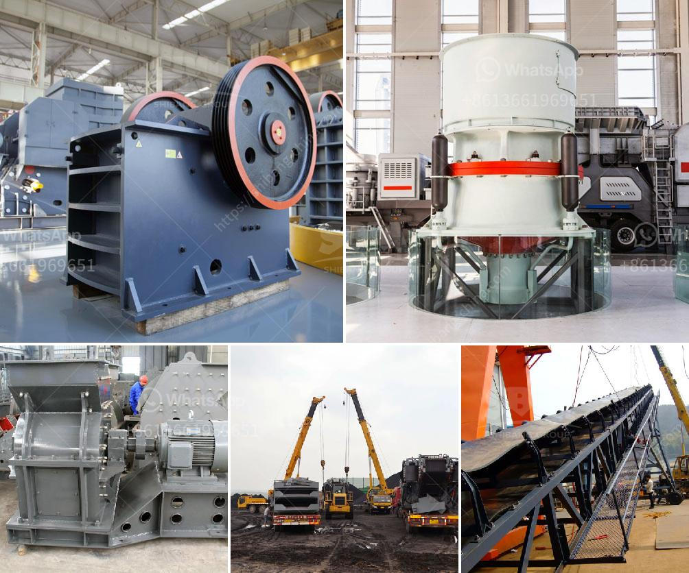

<h3>gold wash plant turkey manufacturer</h3>
Gold wash plants are becoming increasingly popular in the mining industry as they provide a highly efficient and cost-effective way to extract gold from various deposits. One of the leading manufacturers of gold wash plants in Turkey is known for their innovative technology and exceptional quality.

This manufacturer offers a wide range of gold wash plants that are designed to suit different types of mining operations. Whether it is a small-scale mining operation or a large commercial venture, their wash plants can handle various capacities ranging from 50 tons per hour to 300 tons per hour.

One of the key features of these gold wash plants is their mobility. The manufacturer understands that mining operations often require the movement of equipment from one site to another. Therefore, they have designed their plants to be easily transported and set up in different locations. This flexibility allows miners to explore multiple areas and extract gold from various deposits.

Additionally, these gold wash plants are equipped with advanced technology that ensures maximum recovery of gold particles from the input material. The manufacturer understands the importance of efficiency in the mining industry and has incorporated features like high-capacity gold recovery systems, vibration screens, and sluice boxes to ensure thorough gold extraction.

Another advantage of choosing this manufacturer for your gold wash plant needs is their commitment to eco-friendly and sustainable mining practices. They utilize environmentally friendly materials and design their plants to minimize waste generation and water consumption.

In conclusion, if you are looking for a reliable and efficient gold wash plant manufacturer in Turkey, this manufacturer is certainly worth considering. Their range of gold wash plants caters to various mining capacities and their focus on innovation and sustainability make them a top choice for miners. With their advanced technology and high-quality equipment, you can be assured of maximizing your gold recovery and optimizing your mining operations.
<h3>Contact us</h3><ul><li><strong>Whatsapp:&nbsp;<a href="https://wa.me/8613661969651">+8613661969651</a></strong></li><li><a href="https://swt.shibang-china.com/?git&amp;zhl&amp;gold wash plant turkey manufacturer"><strong>Online Service(chat now)</strong></a></li></ul><h3>Related</h3><ul><li><a href='rock crusher dust fog control system philippines.md'>rock crusher dust fog control system philippines</a></li><li><a href='funding for establishment of stone crushers.md'>funding for establishment of stone crushers</a></li><li><a href='used conveyor belt for sale saudi arabia.md'>used conveyor belt for sale saudi arabia</a></li><li><a href='stone crusher for sales in south philippines.md'>stone crusher for sales in south philippines</a></li><li><a href='differences with gyratory crusher cone crusher.md'>differences with gyratory crusher cone crusher</a></li></ul>