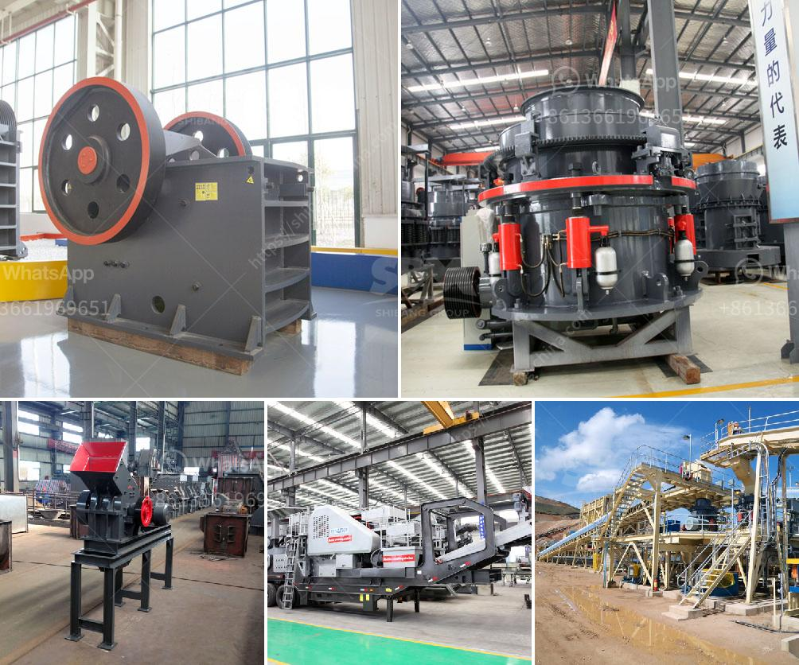

<h3>granite and marble business plan pdf</h3>
A comprehensive business plan is vital for entrepreneurs looking to establish and manage a successful granite and marble business. This article aims to provide an overview of a business plan specifically tailored for this industry, with a focus on the PDF format. The key components and benefits of a well-developed plan will be explored.

Start by outlining the mission, vision, and goals of your granite and marble business. State the market opportunity and what sets your business apart from competitors. Summarize the financial projection and growth prospects. This section should provide a quick snapshot of your business plan.

Describe your company and its organizational structure. Include important legal information and any licenses or permits required to operate your granite and marble business. Define your target market and highlight why you believe it is a profitable niche.

Conduct a thorough analysis of the granite and marble industry, including market trends, competitors, and potential customer segments. Identify your target audience and outline marketing strategies to reach them effectively. Analyze the level of demand for granite and marble in your locality or target market.

Detail the specific types and variations of granite and marble products you plan to offer. Include information about their unique characteristics, quality, pricing, and sourcing. Discuss any additional services you might provide, such as installation, maintenance, or design consultation.

Outline a comprehensive marketing strategy to promote your granite and marble business. Explore various channels such as online platforms, social media, advertisements, and local partnerships. Develop a pricing strategy that ensures profitability while remaining competitive in the market.

Describe the operational aspects of your business, including the resources, equipment, and skills required for quarrying, cutting, and finishing the stones. Outline your supply chain, production process, and quality control measures. Consider logistics, storage, inventory management, and staff requirements.

Provide a detailed financial analysis with projected revenue, costs, and profits. Highlight sources of funding, if applicable, and explain how you plan to allocate your financial resources. Include a break-even analysis and a timeline for achieving profitability.

A granite and marble business plan is crucial for entrepreneurs looking to establish a profitable venture in this industry. By showcasing your knowledge of the market, competitors, and customers, while presenting a clear path to financial success, you'll have a better chance of attracting investors and securing the necessary resources. Utilizing the PDF format ensures easy accessibility and professional presentation. Remember, a well-crafted business plan will serve as a roadmap to guide your decisions and maximize your chances of success in the granite and marble business.
<h3>Contact us</h3><ul><li><strong>Whatsapp:&nbsp;<a href="https://wa.me/8613661969651">+8613661969651</a></strong></li><li><a href="https://swt.shibang-china.com/?git&amp;zhl&amp;granite and marble business plan pdf"><strong>Online Service(chat now)</strong></a></li></ul><h3>Related</h3><ul><li><a href='feasibility study for cocoa unit processing.md'>feasibility study for cocoa unit processing</a></li><li><a href='ball mill supliers in south africa.md'>ball mill supliers in south africa</a></li><li><a href='production of iron ore and manganese.md'>production of iron ore and manganese</a></li><li><a href='raymond grinder mill pakistan.md'>raymond grinder mill pakistan</a></li><li><a href='quarrying crusher machines south africa.md'>quarrying crusher machines south africa</a></li></ul>