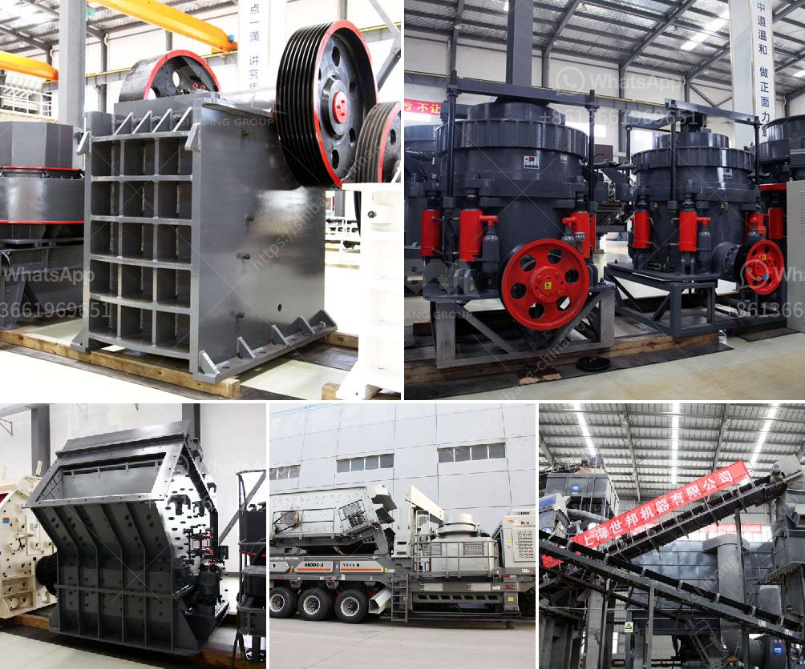

<h3>granite and marble mining in uganda</h3>
Granite and marble are both natural stones that come in a wide array of colors and patterns. They have been used in construction and decoration for centuries, and their popularity has only increased with time. Uganda is endowed with abundant granite and marble deposits. This article will explore the mining practices and potential of these natural stones in Uganda.

Granite mining in Uganda started in the 1920s with small-scale operations around Kisoro and Kanungu districts. The stone was used for construction of colonial buildings, such as the Entebbe International Airport runway, and the Uganda Parliament building. However, it wasn’t until the 1990s that large-scale extraction started with the establishment of quarrying companies like Granite Uganda Ltd, which employed modern techniques and equipment for granite mining.

One of the major granite mining sites in Uganda is located in Rukungiri district in the Western region. The Kilembe quarry covers approximately 45 acres and is a primary source for construction materials used in Uganda's booming real estate industry. The granite extracted from this quarry is used for various applications, such as interior and exterior cladding, flooring, countertops, and monuments.

Marble mining in Uganda, on the other hand, is relatively new with mining operations starting in the 1940s. The main marble mining site in the country is located in Moroto district in the northeastern part of Uganda. Marble has been used for decorative purposes, including sculptures and architectural features, due to its unique veining patterns. The marble quarries in Moroto are known for producing high-quality white and cream-colored marble, which is in high demand both locally and internationally.

The mining process for both granite and marble involves similar steps. It starts with the identification of a suitable quarry site, followed by the extraction of the stone using various techniques, such as drilling, blasting, or wire sawing. Excavators and loaders are used to move the extracted blocks to the processing site. Once at the processing site, the stone is cut into slabs or tiles using diamond wire saws or gang saws. These slabs or tiles are then polished to enhance their beauty and provide a smooth finish.

The granite and marble mining industry in Uganda has faced several challenges over the years. Limited access to financing, lack of modern mining equipment, and inadequate infrastructure have hindered the growth of the sector. However, the government of Uganda has recognized the potential of the natural stone industry and has taken steps to promote its development. This includes providing incentives to encourage investment in the sector, improving infrastructure, and supporting the training of skilled workers.

The mining of granite and marble in Uganda has significant economic potential. It creates employment opportunities for the local population and contributes to the country's revenue through taxes and export earnings. Furthermore, the availability of high-quality natural stones like granite and marble can boost the construction sector, attracting both local and foreign investors.

In conclusion, granite and marble mining in Uganda offer immense potential for economic growth and development. With adequate investment, modern mining practices, and supportive government policies, the sector can flourish and contribute significantly to Uganda's economy. Additionally, the availability of these beautiful natural stones can help showcase Uganda's rich geological heritage and cultural heritage to the world.
<h3>Contact us</h3><ul><li><strong>Whatsapp:&nbsp;<a href="https://wa.me/8613661969651">+8613661969651</a></strong></li><li><a href="https://swt.shibang-china.com/?git&amp;zhl&amp;granite and marble mining in uganda"><strong>Online Service(chat now)</strong></a></li></ul><h3>Related</h3><ul><li><a href='mineral processing calculations pdf.md'>mineral processing calculations pdf</a></li><li><a href='mode of oeration of a gyratory crusher.md'>mode of oeration of a gyratory crusher</a></li><li><a href='grinding ball mill equipment.md'>grinding ball mill equipment</a></li><li><a href='100tph stone crusher for rent india.md'>100tph stone crusher for rent india</a></li><li><a href='quartz mining machineries manufacturers.md'>quartz mining machineries manufacturers</a></li></ul>