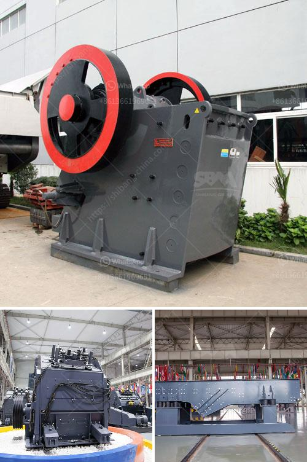

<h3>granite crushers in germany</h3>
Granite is a common and widely occurring type of intrusive, felsic, igneous rock. Granite crushers are used in a variety of industries including mining, smelting, and construction. However, granite crushers can be very expensive for most companies. SBM is a top granite crusher manufacturer from Germany and can supply you granite crushers machine from Germany.

Although Germany is a country with rich mineral reserves, the German mining industry is relatively small and successful. Germany has one of the largest mining industries in the world, with a variety of natural resources including coal, lignite, natural gas, iron ore, copper, nickel, uranium, potash, salt, and precious metals. However, Germany has limited granite resources.

With the advancement of technology and the continuous improvement of crushing equipment, SBM granite crushers have been able to meet the growing market demand. Granite crushers in Germany are the most popular stone crushers in construction and mining industries. They are able to break the large granite into smaller pieces with even size and uniform grain shape. By using the granite crushers made in Germany, companies can effectively reduce their production costs and improve their profits.

SBM granite crushers can be divided into several types, such as jaw crusher, impact crusher, cone crusher, and gyratory crusher, etc. As for the flexibility, these crushers can be adjusted to fit different production requirements. The granite crushers from Germany can process granite, Maykop, Lava, Altai, Neuschwanstein, Rhine Valley, Dresden, and Lahn Valley, etc. Moreover, the production capacity and energy consumption of these crushers are greatly improved compared with traditional crushers.

In conclusion, granite crushers in Germany are the ideal choice for crushing granite materials with high hardness, excellent crushing efficiency, and lower operation cost. Whether you need a single machine or a whole set of crushing equipment, SBM can provide you with comprehensive technical support and after-sales service. Choose SBM, choose success!
<h3>Contact us</h3><ul><li><strong>Whatsapp:&nbsp;<a href="https://wa.me/8613661969651">+8613661969651</a></strong></li><li><a href="https://swt.shibang-china.com/?git&amp;zhl&amp;granite crushers in germany"><strong>Online Service(chat now)</strong></a></li></ul><h3>Related</h3><ul><li><a href='buy nigeria stone crusher.md'>buy nigeria stone crusher</a></li><li><a href='buy sand washing plant in sri lanka.md'>buy sand washing plant in sri lanka</a></li><li><a href='ball mill supliers in south africa.md'>ball mill supliers in south africa</a></li><li><a href='products mobile cone crusher.md'>products mobile cone crusher</a></li><li><a href='limestone crushing and screening.md'>limestone crushing and screening</a></li></ul>