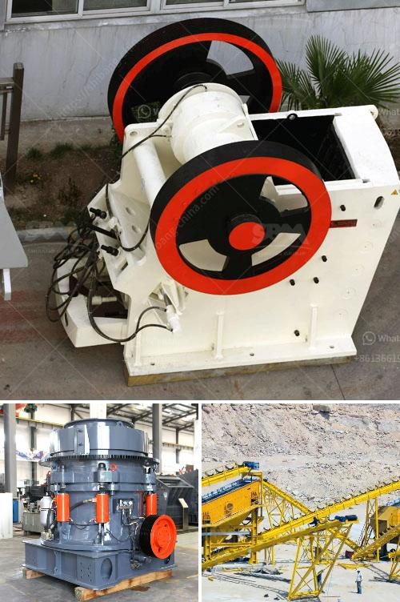

<h3>granite crushing production line</h3>
Granite, as an important part of the aggregate industry, is widely used in various fields due to its high hardness, strong durability, and good plasticity. The process of crushing granite generally includes two steps: coarse crushing and fine crushing. The following introduces the three commonly used granite crushing production lines for you in detail.

Vibrating feeder + jaw crusher + cone crusher + vibrating screen + belt conveyor + other auxiliary equipment.

Jaw crusher is the primary crushing equipment, and cone crusher is the secondary/ fine crushing equipment. Among the machines, there is also a vibrating feeder for the process of feeding the granite, and vibrating screens for grading the crushed granite. Moreover, belt conveyors and other auxiliary equipment are used to connect the machines.

The perfect combination of these machines and the crushing process of the granite ore will ensure the production efficiency and quality of the final products.

The large granite stone is uniformly fed into the jaw crusher by the vibrating feeder for primary crushing. After the coarse crushing, the small stone is sent to the cone crusher for secondary crushing through the conveyor belt. The crushed stones are then screened by vibrating screen and the larger-sized stones are returned to the cone crusher for re-crushing. The qualified materials are sent to the sand making machine for shaping and sand making. After the processing of clean and high-quality sand and gravel aggregates, the finished products are transported to the finished product warehouse through the belt conveyor, and the finished products are finally classified and screened to meet the requirements of customers. 

Granite crushing production line uses jaw crusher and cone crusher combination of crushing equipment, which can realize primary crushing, secondary crushing and tertiary crushing operation. This can simplify the crushing process, save production costs, and improve production efficiency irrespective of the size of the material being crushed.

The whole production line is equipped with energy-saving equipment, such as jaw crusher, cone crusher, vibrating feeder, vibrating screen, belt conveyor, etc. Each equipment requires minimal energy consumption, reducing the production cost of the project.

The granite crushing production line is a kind of stone production line, which is based on the material hardness and high wear resistance index. Granite uses jaw crusher and cone crusher as the main crushing equipment, and uses the impact crusher or shaping machine as the secondary crushing equipment to satisfy different requirements of customers.

Granite crushing production line can be equipped with cone crusher, vibrating screen, dust removal equipment and other equipment. It can be used for aggregate production of hard limestone, granite, basalt, river pebbles, slag and other materials. It is suitable for applications in hydropower, building materials, highways, urban construction and other industries.

In summary, granite crushing production line has a reasonable design, compact structure, and high work efficiency, which is suitable for many economic investment projects. As professional granite crusher manufacturer, SBM Machinery insists on providing customers with the best crushing equipment and solutions. Give full play to the potential of granite and strive to create new opportunities for customers.
<h3>Contact us</h3><ul><li><strong>Whatsapp:&nbsp;<a href="https://wa.me/8613661969651">+8613661969651</a></strong></li><li><a href="https://swt.shibang-china.com/?git&amp;zhl&amp;granite crushing production line"><strong>Online Service(chat now)</strong></a></li></ul><h3>Related</h3><ul><li><a href='gold mining project cost.md'>gold mining project cost</a></li><li><a href='ball mill manufacturer in bhayander.md'>ball mill manufacturer in bhayander</a></li><li><a href='stone crusher in germany.md'>stone crusher in germany</a></li><li><a href='cost of starting a quarry business.md'>cost of starting a quarry business</a></li><li><a href='vertical shaft impact crusher technical specifications.md'>vertical shaft impact crusher technical specifications</a></li></ul>