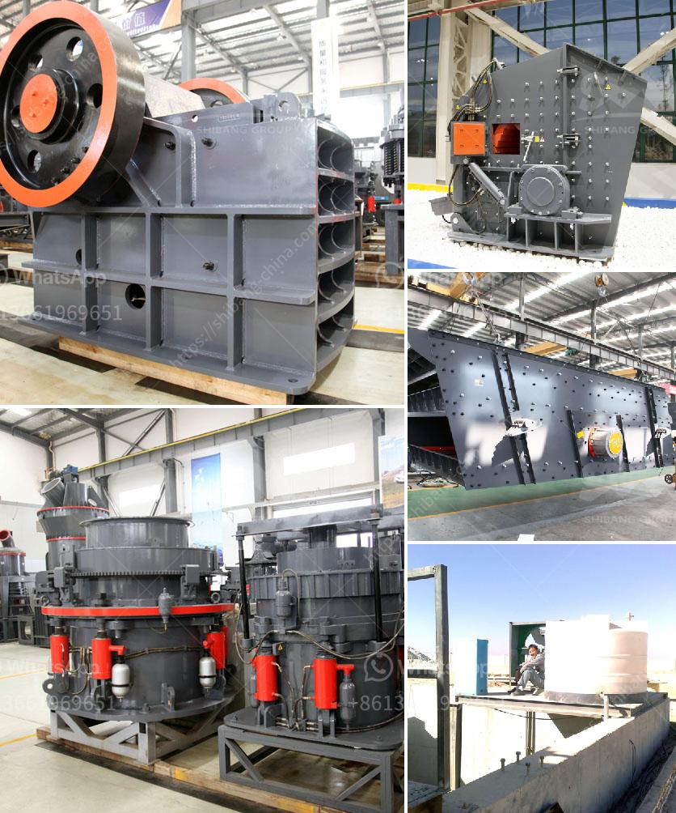

<h3>granite impact crusher</h3>
Granite is a common type of intrusive, felsic, igneous rock which is granular and phaneritic in texture. This rock consists mainly of quartz, mica, and feldspar. Granites sometimes occur in circular depressions surrounded by a range of hills, formed by the metamorphic aureole surrounding the intrusion. Granite is nearly always massive (lacking any internal structures), hard, and tough.

Granite has been used as a building material since ancient times due to its durability and aesthetic appeal. It is an ideal choice for countertops, flooring, and other decorative purposes. However, the extraction of granite from the quarry and its processing into granite slabs, tiles, or other products involve various machinery and equipment. One such important equipment is the granite impact crusher.

Granite impact crusher is a type of impact crusher, which uses the striking force of the impact plate and the rebounding force of the rotor to crush granite materials. The following article will take you to learn about the advantages of granite impact crusher.

Granite impact crusher adopts the unique design of the plate hammer and the impact plate to achieve the crushing effect. It can crush granite materials with a particle size of up to 500mm into fine particles with a size of 25mm or less. This crushing efficiency is much higher than that of traditional crushing equipment.

The impact plate of granite impact crusher is made of high-quality alloy material, with advanced heat treatment process. It has a longer service life and a higher utilization rate compared to ordinary impact plates. The unique design of the plate hammer also improves its wear resistance, making it suitable for crushing hard materials such as granite.

Granite impact crusher has an adjustable discharge size, which can be controlled by adjusting the gap between the impact plate and the rotor. This allows the user to adjust the size according to their needs, ensuring the final product meets their requirements.

Granite impact crusher has a simple structure, fewer parts, and requires less maintenance compared to other types of crushers. This leads to lower maintenance costs and a reduced downtime, ensuring a higher production efficiency and lower operating costs.

Granite impact crusher can be used in various industries, such as mining, construction, and chemical engineering. It is suitable for crushing materials with a compressive strength of up to 350 MPa, such as granite, limestone, and concrete. It can also be used for secondary and fine crushing of materials with a hardness of less than 350 MPa, such as basalt, diabase, and cobblestone.

In conclusion, the granite impact crusher is a reliable and efficient crushing equipment that can be widely used in various industries. Its advanced technology and high-quality materials enable it to withstand the harsh environment and heavy workload, making it a valuable investment for any granite processing plant.
<h3>Contact us</h3><ul><li><strong>Whatsapp:&nbsp;<a href="https://wa.me/8613661969651">+8613661969651</a></strong></li><li><a href="https://swt.shibang-china.com/?git&amp;zhl&amp;granite impact crusher"><strong>Online Service(chat now)</strong></a></li></ul><h3>Related</h3><ul><li><a href='aggregate crusher machine.md'>aggregate crusher machine</a></li><li><a href='crusher machine in gujranwala location.md'>crusher machine in gujranwala location</a></li><li><a href='used conveyor belt for sale saudi arabia.md'>used conveyor belt for sale saudi arabia</a></li><li><a href='sample business plan for stone crusher in bolivia.md'>sample business plan for stone crusher in bolivia</a></li><li><a href='portable limestone crushing systems.md'>portable limestone crushing systems</a></li></ul>