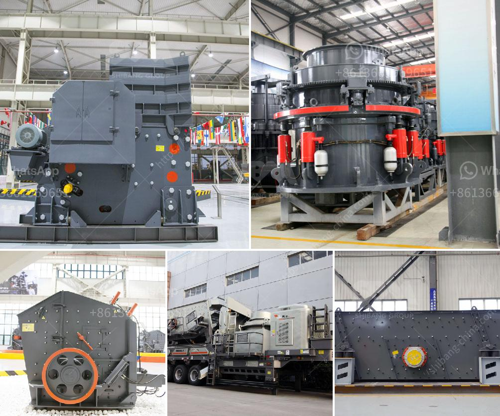

<h3>granite mining business model</h3>
Granite is a type of rock that is used in many construction projects. It is also a popular choice for countertops, flooring, and other decorative accents due to its durability and aesthetic appeal. As a result, the demand for granite is high, creating a lucrative opportunity for entrepreneurs in the mining industry.

A granite mining business model provides entrepreneurs with a clear understanding of the possibilities and challenges involved in this venture. Let's delve into the essential components of such a model.

1. Market Analysis: Before starting a granite mining business, it is crucial to conduct a comprehensive market analysis. This involves assessing the demand for granite in the region or target market. Identifying potential customers, such as construction companies, real estate developers, and interior designers, will help establish a strong customer base.

2. Location Selection: The location of the granite mine plays a vital role in the success of the business. The chosen location should have ample granite deposits and be strategically positioned near target markets. Additionally, the access to transportation infrastructure, such as roads, rail, and ports, should be considered during the location selection process.

3. Legal and Regulatory Compliance: Granite mining involves obtaining various permits, licenses, and clearances from regulatory bodies. Entrepreneurs need to familiarize themselves with the legal requirements and ensure compliance to avoid any legal complications. This includes obtaining mining leases, environmental clearances, and adhering to labor laws and safety regulations.

4. Investment and Financial Planning: Setting up a granite mining business requires significant capital investment. Entrepreneurs need to determine the estimated cost of acquiring land, equipment, machinery, and manpower. Adequate financial planning is necessary to secure funding from banks or investors. It is also essential to prepare a detailed financial projection, including expected revenue, operating costs, and return on investment.

5. Mining Operations: Once all the necessary permits and equipment are in place, entrepreneurs can commence mining operations. This involves extracting granite from the mine using advanced machinery like loaders, excavators, and crushers. Proper workforce management is crucial for efficient mining operations. It is also essential to ensure the safety of workers and adhere to environmental protection measures during the extraction process.

6. Processing and Distribution: After the granite has been extracted, it needs to undergo processing to enhance its quality and make it suitable for various applications. This involves cutting, shaping, polishing, and finishing the granite slabs or tiles. Setting up a processing plant near the mining site can help reduce transportation costs and improve efficiency. Establishing a well-connected distribution network is crucial to ensure timely delivery of the finished products to customers.

7. Marketing and Sales: A comprehensive marketing and sales strategy is essential in promoting the granite mining business. This includes creating a strong online presence through websites and social media, participating in industry trade shows and exhibitions, and building relationships with potential customers. Offering competitive pricing, excellent customer service, and quality products will help attract and retain customers.

In conclusion, setting up a granite mining business requires careful planning and execution. Conducting a market analysis, selecting the right location, complying with legal and regulatory requirements, and developing a comprehensive financial plan are key components of a successful business model. By efficiently managing mining operations, processing, distribution, and marketing, entrepreneurs can tap into the lucrative granite industry and achieve long-term success.
<h3>Contact us</h3><ul><li><strong>Whatsapp:&nbsp;<a href="https://wa.me/8613661969651">+8613661969651</a></strong></li><li><a href="https://swt.shibang-china.com/?git&amp;zhl&amp;granite mining business model"><strong>Online Service(chat now)</strong></a></li></ul><h3>Related</h3><ul><li><a href='marble and granite plant.md'>marble and granite plant</a></li><li><a href='list of machinery used in the quarry.md'>list of machinery used in the quarry</a></li><li><a href='gypsum powder production equipment price.md'>gypsum powder production equipment price</a></li><li><a href='small scale copper refining equipment.md'>small scale copper refining equipment</a></li><li><a href='marble factory production line.md'>marble factory production line</a></li></ul>