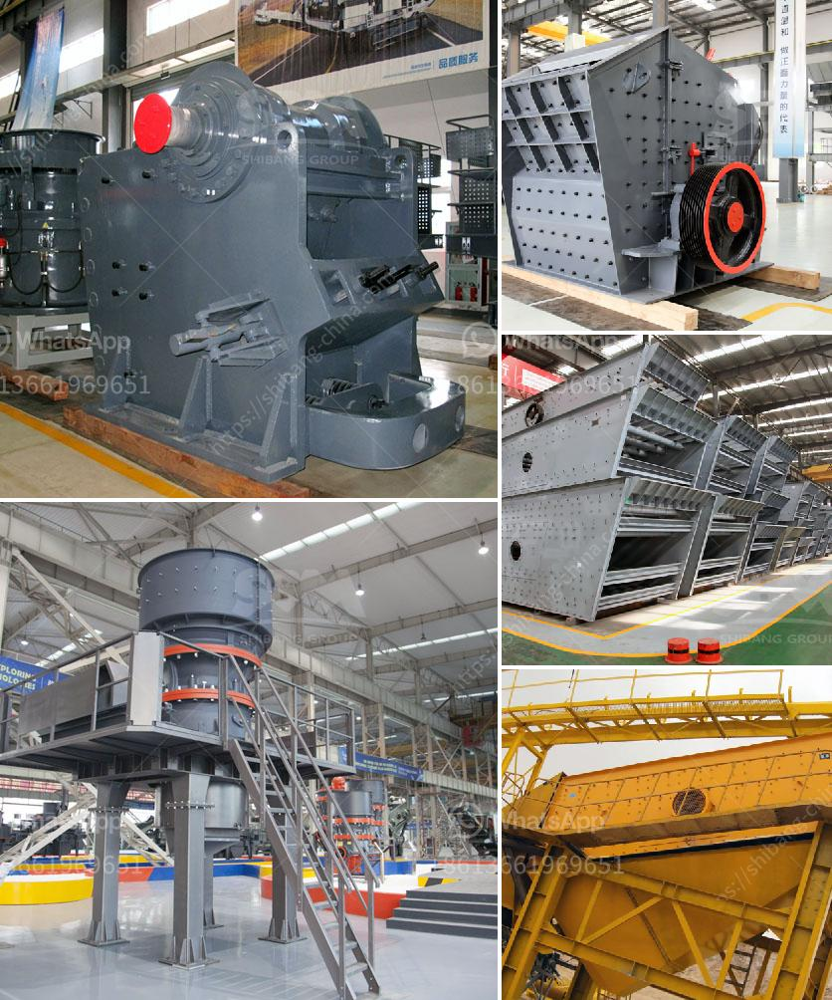

<h3>granite quarry crusher equipment</h3>
Granite has a wide application in many industries, such as construction, road construction, and infrastructure projects, among others. It could be categorized into three main types based on its hardness: hard, medium-hard, and soft rock. Granite quarrying process mainly refers to the granite ore crushing process. As a professional manufacturer of granite quarry crusher equipment, SBM can offer various granite crushing machines for the quarry crusher production line.

Typically, the granite ore crushing equipment includes jaw crusher, impact crusher, cone crusher, and VSI crusher, etc. As for the crushing process, aim has many different processing steps, such as primary crushing, secondary crushing, tertiary crushing, screening, and size reduction. There are many factors influencing the final quarry crusher product quality and capacity, such as the type of raw material, the crushing cavity of the granite quarry crusher, the feeding size, the final product size, the clearance between the impact plate and the hammer, etc.

Our granite quarry crusher equipment can also be used to crush many other materials such as marble, feldspar, calcite, mica, granite, concrete, barite, etc. After years of research and development, we have designed various kinds of granite crushers and the optimized performance has attracted more and more customers to us.

Therefore, the granite quarry crusher equipment provided by SBM is the best choice for all kinds of granite quarries. In the actual crushing process, we need to combine the above-mentioned granite crushers to meet the different needs. Besides, innovations can also be made in mechanical equipment to optimize production techniques and improve efficiency. With continuous efforts, we are committed to providing better granite quarry crusher equipment and comprehensive technical support to our customers all over the world.

In conclusion, the granite quarry crusher equipment provided by SBM is the best choice for all kinds of granite quarries. The granite crushing process is mainly divided into primary crushing, secondary crushing, and fine crushing. As for the selection of granite crusher equipment, it should be based on the specific needs of the quarry site and the actual crushing capacity required. SBM provides various types and models of granite quarry crusher equipment, with high-quality and competitive prices. Choose SBM, choose success!
<h3>Contact us</h3><ul><li><strong>Whatsapp:&nbsp;<a href="https://wa.me/8613661969651">+8613661969651</a></strong></li><li><a href="https://swt.shibang-china.com/?git&amp;zhl&amp;granite quarry crusher equipment"><strong>Online Service(chat now)</strong></a></li></ul><h3>Related</h3><ul><li><a href='raymond mill in collins.md'>raymond mill in collins</a></li><li><a href='used stone crusher for sale europe.md'>used stone crusher for sale europe</a></li><li><a href='iron ore 100 150tph belt conveyor price.md'>iron ore 100 150tph belt conveyor price</a></li><li><a href='raymond mill price in india.md'>raymond mill price in india</a></li><li><a href='crushing and screening of aggregates in mexico.md'>crushing and screening of aggregates in mexico</a></li></ul>