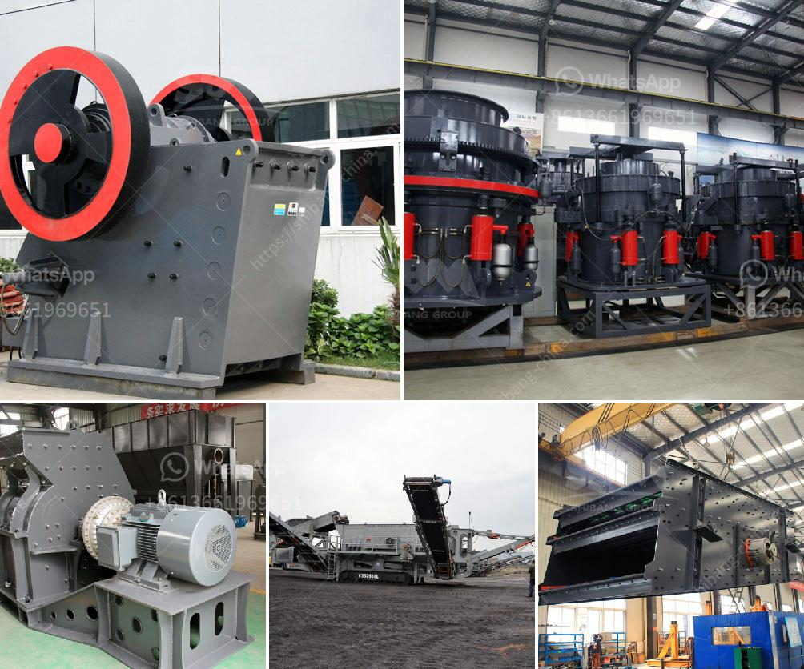

<h3>granite quarry machinery from turkey</h3>
Granite is a hard, volcanic rock that is quarried and polished to create a variety of beautiful natural stone products. It is an igneous rock formed from magma that solidifies slowly to form coarse-grained crystals. Present in various colors and patterns, granite is a popular choice for countertops, flooring, and other architectural features due to its durability and aesthetic appeal.

Turkey, known for its rich and diverse geological heritage, boasts numerous granite quarries throughout the country. With its unique geographic location between Europe and Asia, Turkey has been a major player in the global stone industry for centuries. Its granite quarries have been famous for producing high-quality, unique stones that have adorned structures all over the world since ancient times.

The extraction of granite from quarries requires sophisticated machinery to cut, extract, and shape the stone. As the demand for granite products has increased over the years, so has the need for advanced machinery to handle the extraction process efficiently. Turkey has been at the forefront of developing innovative technology and machinery for the granite quarry industry.

Turkish granite quarry machinery utilizes state-of-the-art technology and advanced equipment in all stages of the extraction, processing, and polishing of granite. This machinery can handle larger volumes of granite blocks while still maintaining the high level of precision and quality required for the finest granite products.

One of the most prominent types of machinery used in Turkish granite quarries is diamond wire cutting machines. These machines use a diamond-coated wire to cut through the granite smoothly and accurately. Unlike traditional quarrying methods that involve the use of explosives, diamond wire cutting machines provide a safer and more environmentally friendly alternative. They also minimize waste and enable quarry operators to extract larger blocks of granite.

Another essential piece of machinery found in Turkish granite quarries is the diamond-based chain saw. These saws are used to cut through granite with precision and efficiency. They are particularly useful in extracting granite blocks from the quarry face, reducing the risk of damage and waste. Diamond-based chain saws are operated remotely and can be used even in inaccessible or challenging areas.

In addition to cutting machinery, Turkish granite quarries also employ advanced polishing machines to enhance the natural beauty of granite surfaces. These machines use abrasive pads and polishing compounds to achieve a smooth, glossy finish desired for countertops, floors, and other applications. Turkish manufacturers have developed polishing machines that can handle a wide range of granite products, ensuring consistent quality across the board.

The high-quality granite quarry machinery from Turkey has earned a reputation worldwide for its excellent performance and durability. The advanced technology and innovative solutions employed in the machinery have significantly contributed to the growth and success of the Turkish stone industry.

In conclusion, Turkey's granite quarry machinery has played a vital role in the global stone industry. With its advanced technology and innovative solutions, Turkish machinery has enabled efficient extraction, processing, and polishing of granite, resulting in high-quality products that are in high demand around the world. As the Turkish stone industry continues to evolve, the machinery from Turkey's granite quarries will undoubtedly keep pushing boundaries and setting new standards for the industry.
<h3>Contact us</h3><ul><li><strong>Whatsapp:&nbsp;<a href="https://wa.me/8613661969651">+8613661969651</a></strong></li><li><a href="https://swt.shibang-china.com/?git&amp;zhl&amp;granite quarry machinery from turkey"><strong>Online Service(chat now)</strong></a></li></ul><h3>Related</h3><ul><li><a href='coal handling plant maintenance pdf.md'>coal handling plant maintenance pdf</a></li><li><a href='slag crusher for sale.md'>slag crusher for sale</a></li><li><a href='fly ash grinding machine manufacturar in india.md'>fly ash grinding machine manufacturar in india</a></li><li><a href='iron ore production from chrysotile.md'>iron ore production from chrysotile</a></li><li><a href='companies selling mining equipment in dubai.md'>companies selling mining equipment in dubai</a></li></ul>