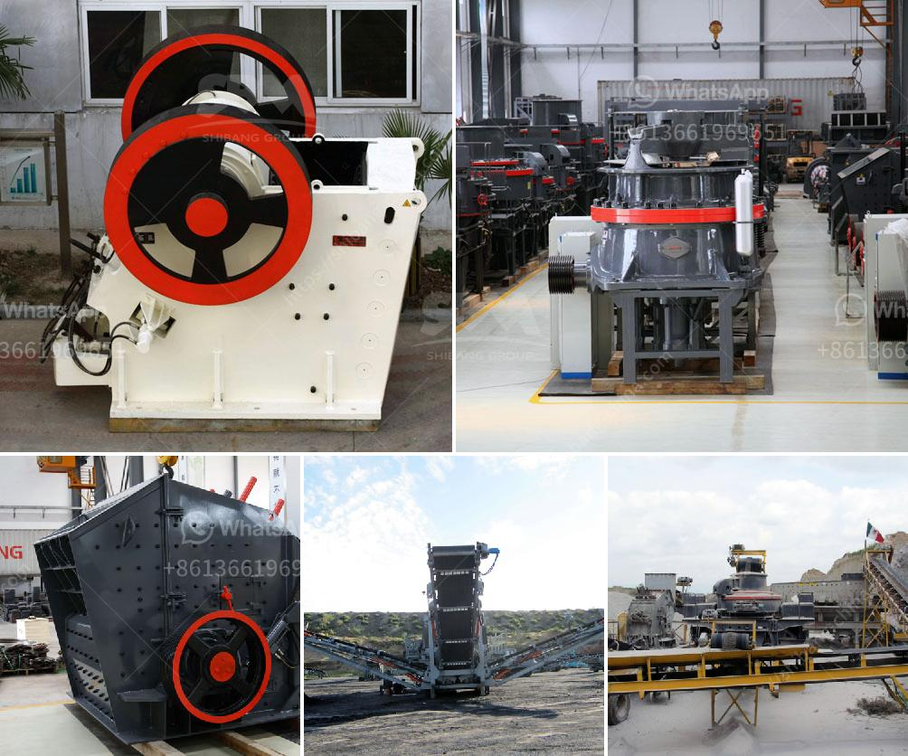

<h3>granite quarry organisation chart</h3>
Granite is a type of rock that is widely used in construction. With its beautiful aesthetic appeal and durability, it has become a popular choice for countertops, flooring, and other architectural elements. However, before granite can be transformed into these products, it needs to go through a complex process that involves quarrying.

A granite quarry is a place where large blocks of granite are extracted, cut, and transported for further processing. In order to understand the organisational structure of a granite quarry, it is helpful to refer to an organizational chart. A well-designed organisational chart can help streamline the operations, assign responsibilities, and improve communication within the quarry.

At the top level of the organisational chart, you will typically find the owner or the board of directors. These individuals are responsible for setting the overall direction and goals for the quarry. They make decisions regarding investment in new equipment, expansion of the quarry, and other strategic matters.

Reporting directly to the owner or board of directors, you will find the quarry manager. This individual is responsible for overseeing the day-to-day operations of the quarry. They manage the quarry employees, ensure that all safety and environmental regulations are followed, and make decisions regarding the extraction process.

The quarry manager is supported by a team of supervisors and foremen who are in charge of different aspects of the operation. For example, there may be a production supervisor who is responsible for overseeing the extraction and cutting processes. They ensure that the quarry is operating efficiently and that the required quality standards are met.

Another important role within the organisational chart is that of the maintenance supervisor. They are responsible for keeping all the equipment and machinery in good working order. They schedule regular maintenance and repairs to minimize downtime and ensure that the production process is not affected.

Underneath the supervisors and foremen, you will find a team of quarry workers. These individuals are responsible for carrying out the different tasks involved in the quarrying process. This may include drilling holes in the rock, using explosives to extract the granite blocks, and loading the blocks onto trucks for transportation.

Lastly, there may be administrative staff within the organisational chart. These individuals handle the administrative tasks such as maintaining records, managing payroll, and coordinating with suppliers and customers. They play a crucial role in ensuring that the quarry operates smoothly and efficiently.

In conclusion, a well-designed organisational chart is essential for a granite quarry to function effectively. It helps assign responsibilities, improve communication, and streamline operations. From the owner or board of directors at the top level, to the supervisors, foremen, quarry workers, and administrative staff, each individual plays a crucial role in the quarrying process. By working together, they ensure the successful extraction, processing, and distribution of granite for use in construction projects.
<h3>Contact us</h3><ul><li><strong>Whatsapp:&nbsp;<a href="https://wa.me/8613661969651">+8613661969651</a></strong></li><li><a href="https://swt.shibang-china.com/?git&amp;zhl&amp;granite quarry organisation chart"><strong>Online Service(chat now)</strong></a></li></ul><h3>Related</h3><ul><li><a href='feldspar crusher unit.md'>feldspar crusher unit</a></li><li><a href='kenya cone crusher is manufactured.md'>kenya cone crusher is manufactured</a></li><li><a href='limestone plant and machinery.md'>limestone plant and machinery</a></li><li><a href='crushers and screeners for sale.md'>crushers and screeners for sale</a></li><li><a href='fly ash grinding machine manufacturar in india.md'>fly ash grinding machine manufacturar in india</a></li></ul>