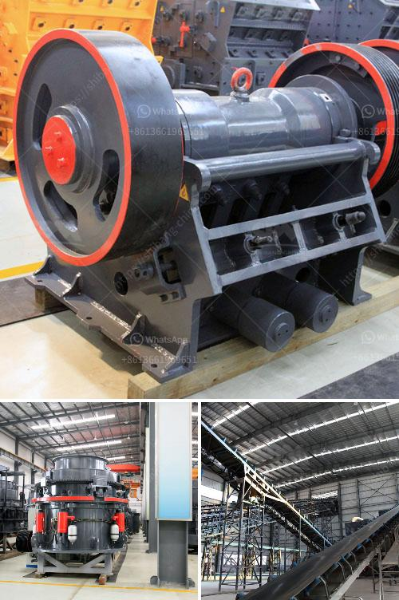

<h3>granite stone crushers</h3>
Granite has become one of the most popular materials for countertops, flooring, and other projects in homes and commercial spaces. The beauty and durability of granite make it a sought-after choice for both interior and exterior applications. However, the process of extracting and crushing granite can be extremely challenging.

Granite is a hard rock with a high silica content, making it difficult to crush. Due to its hardness, wear and tear on equipment are inevitable. To overcome this challenge, crusher manufacturers have developed specialized equipment for the crushing process.

One such piece of equipment is the granite stone crusher. Crushing granite, with a machine that has a crushing capacity of between 300 and 500 tons per hour, is a cost-effective and efficient way to process materials with moderate hardness. By using a crusher, granite can be crushed into different sizes, thereby creating a more uniform appearance and increasing its usability.

The granite stone crusher works by utilizing a pair of jaws. These jaws, one fixed and the other moving, slowly apply pressure to the granite, breaking it down into smaller pieces. The jaws exert force on the granite, pushing it against the fixed jaw until it breaks. This process continues until the desired size is achieved.

To ensure the granite stone crusher works efficiently, it is essential to maintain and lubricate the machine regularly. This will help keep the machine running smoothly and reduce any potential issues caused by wear and tear. Additionally, regular maintenance will extend the lifespan of the equipment, reducing the need for costly repairs or replacement.

Granite stone crushers are available in different sizes to accommodate varying processing needs. Smaller crushers are ideal for small-scale projects, such as residential countertops or garden paths. These smaller crushers have a lower crushing capacity, but they are more affordable and easier to move.

On the other hand, larger crushers are capable of processing massive amounts of granite. They are suitable for large-scale construction projects, such as highways or commercial buildings. These crushers have a higher crushing capacity and are typically stationary, making them more suitable for permanent installations.

When choosing a granite stone crusher, it is important to consider factors such as the required crushing capacity, the material size, and the specific application. Additionally, it is crucial to select a reputable manufacturer that offers reliable equipment, warranties, and after-sales support.

In conclusion, granite stone crushers are essential equipment for processing granite into different sizes. The specialized machinery can handle the hardness of granite, ensuring effective and efficient crushing. Regular maintenance is crucial for the smooth operation of the machines, while choosing the right size and reputable manufacturer will provide long-lasting and reliable equipment for any granite crushing project.
<h3>Contact us</h3><ul><li><strong>Whatsapp:&nbsp;<a href="https://wa.me/8613661969651">+8613661969651</a></strong></li><li><a href="https://swt.shibang-china.com/?git&amp;zhl&amp;granite stone crushers"><strong>Online Service(chat now)</strong></a></li></ul><h3>Related</h3><ul><li><a href='gypsum crusher plant pdf.md'>gypsum crusher plant pdf</a></li><li><a href='barite grinding plants in nigeria.md'>barite grinding plants in nigeria</a></li><li><a href='mobile plant sand screen for sale.md'>mobile plant sand screen for sale</a></li><li><a href='manganese crusing and processing shipping.md'>manganese crusing and processing shipping</a></li><li><a href='pineaple crushing machine in ghana.md'>pineaple crushing machine in ghana</a></li></ul>