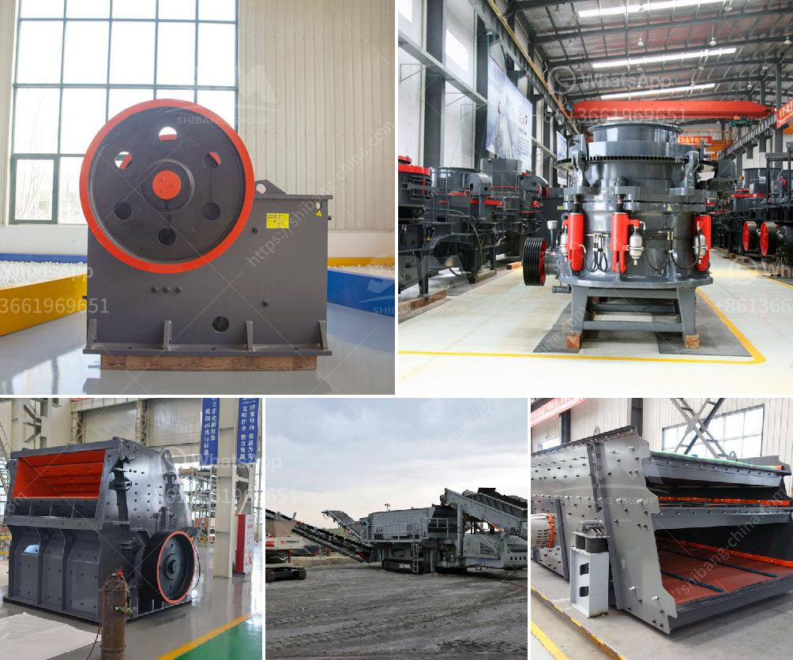

<h3>graphite powder machine</h3>
Graphite is a naturally occurring form of carbon that has found numerous applications in various industries due to its unique properties. One of the most common uses of graphite is in the manufacturing of pencils, where it serves as the core material that leaves a mark on paper. However, graphite has also found its way into more advanced applications, such as in the production of lubricants, batteries, and even in machinery and equipment.

The demand for graphite powder in industries has led to the development of specialized graphite powder machines. These machines are designed to crush, grind, and process graphite into fine powder, making it easier to incorporate into various products. The graphite powder machines come in different sizes, with varying capacities and capabilities to suit different industrial needs.

One of the most popular graphite powder machines is the graphite powder making machine. This machine is designed to grind graphite into a fine powder for use in applications that require a high degree of fineness. It is equipped with advanced grinding technology and a powerful motor that enables it to produce graphite powder with a particle size ranging from 3 to 25 microns.

The graphite powder making machine operates by feeding graphite materials into the grinding chamber, where they are crushed and ground by high-speed rotating hammers. The ground graphite particles are then carried by the airflow into a classifier, which separates the fine powder from the coarse ones. The fine graphite powder is collected in a cyclone separator and discharged through a dedicated outlet, while the coarse particles are returned to the grinding chamber for further processing.

What sets the graphite powder making machine apart from other graphite powder machines is its ability to achieve a high degree of fineness. This is critical in applications that require precise control over particle size and distribution. For example, in the battery industry, graphite powder is used as an anode material, and the particle size is a critical parameter that determines the battery's performance.

In addition to the graphite powder making machine, there are also graphite grinding mills available in the market. These mills are designed for larger-scale production and offer higher capacity and throughput. They are equipped with multiple grinding chambers, each with its own set of grinding media, allowing for continuous operation and higher productivity.

The graphite powder machines, including the graphite powder making machine and graphite grinding mills, have revolutionized the graphite processing industry. They offer efficient and cost-effective solutions for producing high-quality graphite powder that meets the demanding requirements of various industries. With the advancement in technology, these machines continue to evolve and improve, further enhancing their capabilities and expanding their applications in the global market.

In conclusion, the graphite powder machines, such as the graphite powder making machine and graphite grinding mills, play a crucial role in the graphite processing industry. They enable the production of fine graphite powder with precise particle size control, making it suitable for various applications. These machines have greatly contributed to the advancement of industries that rely on graphite, ensuring efficient and high-quality production processes.
<h3>Contact us</h3><ul><li><strong>Whatsapp:&nbsp;<a href="https://wa.me/8613661969651">+8613661969651</a></strong></li><li><a href="https://swt.shibang-china.com/?git&amp;zhl&amp;graphite powder machine"><strong>Online Service(chat now)</strong></a></li></ul><h3>Related</h3><ul><li><a href='grinding equipment for cement plant.md'>grinding equipment for cement plant</a></li><li><a href='gypsum mining plant.md'>gypsum mining plant</a></li><li><a href='used steel ball mill.md'>used steel ball mill</a></li><li><a href='portalble stone crusher.md'>portalble stone crusher</a></li><li><a href='ball mills caractecrsistiacs techniques.md'>ball mills caractecrsistiacs techniques</a></li></ul>