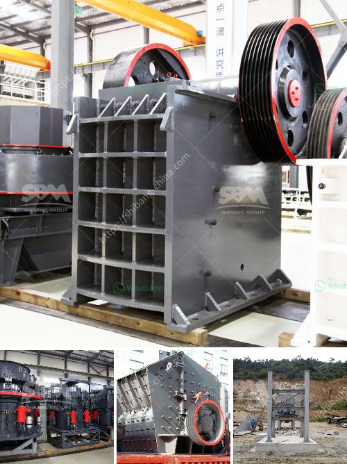

<h3>graphite processing machine</h3>
Graphite has become an essential material in various industries due to its unique properties and applications. From lithium-ion batteries to aerospace components, graphite plays a crucial role in powering modern technologies. To meet the growing demand for graphite, efficient graphite processing machines have become vital in the production process.

Graphite processing machines are designed to convert raw graphite into high-quality products suitable for various applications. These machines go through different stages to transform the graphite feedstock into a finished product, ensuring that it meets the required specifications and quality standards.

One of the primary processes in graphite processing is size reduction. Raw graphite undergoes crushing and grinding in specialized machines to break it down into smaller particles. This process improves the material's surface area and facilitates subsequent processing stages without compromising the graphite's properties.

After size reduction, the graphite particles undergo a purification process to remove impurities such as minerals, metals, and other foreign materials. Purification helps enhance the graphite's purity and significantly improves its thermal and electrical conductivity, making it suitable for applications like electrical components and thermal management solutions.

The next step in graphite processing involves shaping the purified graphite into the desired form. This can be done through various techniques such as molding, extrusion, and compression. These methods help create graphite products with specific shapes and dimensions that conform to industry requirements.

To further enhance the graphite's properties, additional processes like graphitization and surface treatment may be employed. Graphitization involves subjecting the graphite to high temperatures to transform it into a more graphite-like structure, enhancing its thermal and electrical conductivity. Surface treatment, on the other hand, modifies the graphite's surface properties to improve its performance in specific applications, such as corrosion resistance or lubricity.

In recent years, advanced graphite processing machines have incorporated automation and computer control systems to optimize efficiency and precision. Automated machines can carry out multiple processing steps with minimal human intervention, reducing the chances of errors and increasing production rates. Computer control systems enable operators to monitor and adjust processing parameters in real-time, ensuring consistent product quality and minimizing waste.

It is worth noting that graphite processing machines are not limited to large-scale industrial operations. Smaller-scale machines are also available for research and development purposes or for businesses with lower production volumes. These machines offer flexibility and cost-effectiveness, enabling smaller companies to enter the graphite market and explore new applications or product concepts.

In conclusion, graphite processing machines are integral to the production of high-quality graphite products. By undergoing various stages such as size reduction, purification, shaping, and additional treatments, raw graphite can be transformed into a material suitable for diverse applications. With the integration of automation and computer control systems, these machines offer improved efficiency, precision, and flexibility. As the demand for graphite continues to rise, investing in reliable graphite processing machines becomes crucial for manufacturers aiming to meet industry requirements and deliver top-notch graphite products.
<h3>Contact us</h3><ul><li><strong>Whatsapp:&nbsp;<a href="https://wa.me/8613661969651">+8613661969651</a></strong></li><li><a href="https://swt.shibang-china.com/?git&amp;zhl&amp;graphite processing machine"><strong>Online Service(chat now)</strong></a></li></ul><h3>Related</h3><ul><li><a href='rod mill for sale perth.md'>rod mill for sale perth</a></li><li><a href='bentonite powder plant in uae.md'>bentonite powder plant in uae</a></li><li><a href='rock processing plant.md'>rock processing plant</a></li><li><a href='price crusher 30 ton.md'>price crusher 30 ton</a></li><li><a href='quote for vsi crusher.md'>quote for vsi crusher</a></li></ul>