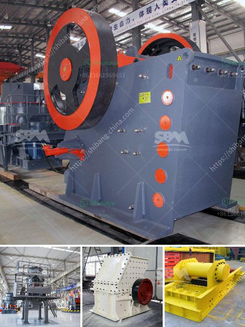

<h3>gravel crusher equipment</h3>
Gravel is a versatile material that can be used in many construction applications. It can be used as a base for driveways, pathways, and parking lots, as well as for landscaping and drainage projects. To ensure that the gravel is properly crushed and screened for consistent size and quality, a gravel crusher equipment is essential for any construction site.

A gravel crusher equipment is a machine designed to reduce large rocks into smaller rocks, gravel, or rock dust. It can also be used to crush stones and hard rocks, such as basalt, marble, granite, and limestone. These machines have a variety of uses and play an important role in both construction and mining industries.

Here are some key features of gravel crusher equipment that make them a must-have for construction sites:

1. Versatility: Gravel crushers can be used to crush a wide range of materials, making them suitable for various construction applications. They can handle both soft and hard rocks, as well as different sizes of gravel.

2. Efficiency: With the ability to crush materials into specific sizes, gravel crushers ensure that the gravel used in construction projects meets the desired specifications. This helps to improve the overall efficiency and quality of the construction process.

3. Mobility: Many gravel crusher equipment are mobile and can be easily transported to different construction sites. This allows contractors to quickly and efficiently deliver crushed gravel to wherever it is needed.

4. Durability: Gravel crusher equipment is built to withstand the harsh conditions of construction and mining industries. They are designed to be durable and reliable, even in tough environments.

5. Safety: Modern gravel crusher equipment is designed with safety features to protect operators and prevent accidents. These features include protective barriers, emergency stop buttons, and warning signs.

In conclusion, gravel crusher equipment is an essential tool for any construction site. Its versatility, efficiency, mobility, durability, and safety features make it a valuable asset for contractors and construction companies. By investing in high-quality gravel crusher equipment, you can ensure that your construction projects are completed on time, within budget, and to the highest quality standards.
<h3>Contact us</h3><ul><li><strong>Whatsapp:&nbsp;<a href="https://wa.me/8613661969651">+8613661969651</a></strong></li><li><a href="https://swt.shibang-china.com/?git&amp;zhl&amp;gravel crusher equipment"><strong>Online Service(chat now)</strong></a></li></ul><h3>Related</h3><ul><li><a href='used coal washing plants for sale in india.md'>used coal washing plants for sale in india</a></li><li><a href='silica sand crusher in ghana.md'>silica sand crusher in ghana</a></li><li><a href='stone crushers gold.md'>stone crushers gold</a></li><li><a href='jaw crusher 200 tph parts details.md'>jaw crusher 200 tph parts details</a></li><li><a href='thailand for stone crusher plant.md'>thailand for stone crusher plant</a></li></ul>