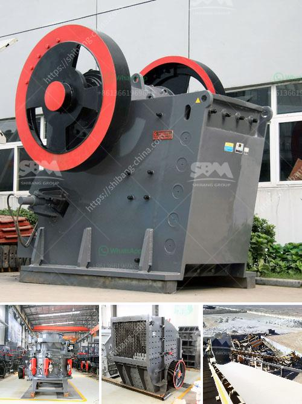

<h3>gravel crushers for sale in manila philippines</h3>
For the nearly two centuries, gravel crushers have been in widespread use in most aggregate industries. These machines have a proven track record of performance, adaptability, and durability, all essential qualities in the ideal aggregate crushing equipment.

The wide array of choices available to Manila, Philippines-based enterprises enables them to select the most suitable gravel crusher that can cater to their specific needs. The primary purpose of a gravel crusher is to break down large rocks into smaller pieces, reducing them to the desired size for easy handling, transportation, and subsequent processing.

One of the main advantages of gravel crushers is their versatility. They can handle a wide range of materials, such as concrete, asphalt, and various types of rocks. Whether it's a construction site, a quarry, or a mining operation, a gravel crusher can effectively process these materials into high-quality aggregates needed for various construction projects.

In Manila, Philippines, the market for gravel crushers is expanding due to the growing demand for aggregates used in infrastructure projects. With the government's focus on infrastructure development, there is a strong need for quality aggregates to be used in the construction of roads, bridges, buildings, and other structures.

A gravel crusher is an essential piece of equipment for a wide range of applications, including the recycling of concrete, asphalt, and demolition debris. It can also be used for crushing natural stones, such as limestone, granite, and basalt, to produce aggregates for use in construction projects.

When choosing a gravel crusher for sale, Manila-based enterprises should consider factors such as the size and hardness of the materials they want to process, the desired output size, capacity requirements, and the specific features and capabilities of the machine. They should also take into account the reputation and reliability of the manufacturer or dealer, ensuring that they offer quality equipment and excellent after-sales service.

Popular types of gravel crushers available in the market include jaw crushers, cone crushers, impact crushers, and hammer crushers. Each type has its own unique features and advantages. For example, jaw crushers are known for their high crushing capacity and excellent reduction ratio, making them suitable for primary crushing applications.

Cone crushers, on the other hand, are ideal for secondary and tertiary crushing, producing well-shaped and finely graded aggregates. Impact crushers are versatile machines that can handle a wide range of materials and are often used for primary and secondary crushing. Hammer crushers are primarily used for crushing brittle materials, such as limestone, and are commonly used in the mining industry.

In conclusion, gravel crushers are indispensable equipment for the aggregate industry in Manila, Philippines. They offer efficient and reliable crushing of various materials, enabling the production of high-quality aggregates needed for construction projects. Manila-based enterprises should carefully consider their specific requirements and select a gravel crusher that best suits their needs, ensuring productivity, versatility, and longevity. Finding a reputable manufacturer or dealer with a track record of delivering quality equipment and excellent after-sales service is crucial to ensure a successful investment in a gravel crusher.
<h3>Contact us</h3><ul><li><strong>Whatsapp:&nbsp;<a href="https://wa.me/8613661969651">+8613661969651</a></strong></li><li><a href="https://swt.shibang-china.com/?git&amp;zhl&amp;gravel crushers for sale in manila philippines"><strong>Online Service(chat now)</strong></a></li></ul><h3>Related</h3><ul><li><a href='limestone production mining equipment for sale.md'>limestone production mining equipment for sale</a></li><li><a href='horizontal grinding mills price.md'>horizontal grinding mills price</a></li><li><a href='china quartz sand dryer manufacturer.md'>china quartz sand dryer manufacturer</a></li><li><a href='the cost of a clay brick making machine in south africa.md'>the cost of a clay brick making machine in south africa</a></li><li><a href='feldspar ball mills manufacturers.md'>feldspar ball mills manufacturers</a></li></ul>