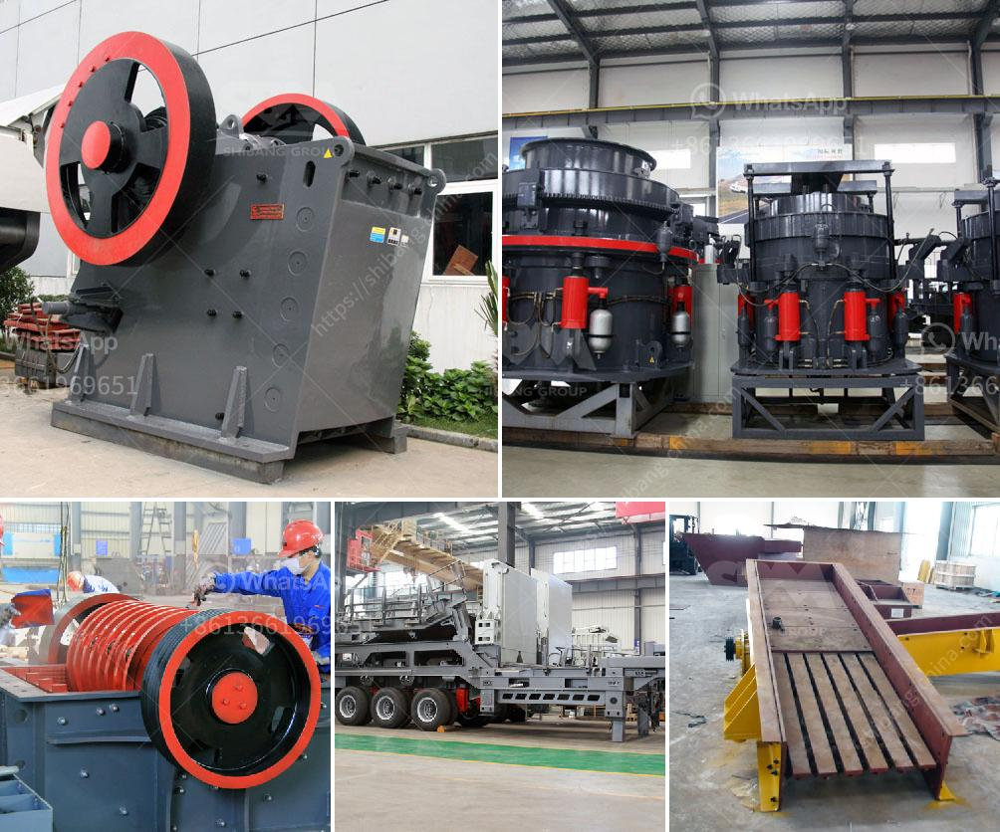

<h3>gravel gravel and sand mining equipment</h3>
Gravel and sand are vital resources found in abundance all around the world. These materials are used in a variety of industries, such as construction, landscaping, and agriculture. However, the process of extracting gravel and sand from natural deposits requires specialized equipment. In this article, we will provide an overview of the essential equipment used in gravel and sand mining.

1. Excavators: Excavators are heavy machinery commonly used in mining operations. These machines have a bucket attached to a hydraulic arm that enables them to move large amounts of material efficiently. In gravel and sand mining, excavators are used to dig and collect materials from the ground or riverbeds.

2. Bulldozers: Bulldozers are powerful machines equipped with a large blade at the front. They are widely used in mining operations to push and scoop large amounts of soil, sand, or gravel. Bulldozers are essential in creating access roads and clearing vegetation in mining areas.

3. Dump trucks: Dump trucks are robust vehicles designed to haul and transport materials from mining sites. These trucks come in various sizes and can carry a wide range of loads, including gravel, sand, and other aggregate materials. Dump trucks are commonly used to move materials from the mining site to processing or storage areas.

4. Crushers: Crushers play a crucial role in gravel and sand mining operations. These machines break down large rocks and stones into smaller, more manageable sizes. Crushers are often used to process raw materials extracted from mining sites, turning them into usable aggregate for construction and other industries.

5. Dredges: Dredges are specialized equipment used in sand and gravel mining operations conducted in rivers, lakes, or harbors. These machines are designed to dig, scoop, or suction sand and gravel from the bottom of water bodies. Dredges are commonly used to extract materials from underwater deposits and transport them to processing facilities.

6. Screening equipment: Screening equipment is used to separate and classify different sizes of gravel and sand particles. Vibrating screens, for example, are commonly used to remove small rocks and debris from the extracted materials. This process ensures that the final product is of the desired size and free from contaminants.

7. Wash plants: Wash plants are designed to remove impurities and contaminants from gravel and sand. These plants use water and various processes to clean the materials, ensuring that they meet industry standards and are suitable for use in construction and other applications. Wash plants often include screens, crushers, and other equipment to facilitate the washing process.

In conclusion, gravel and sand mining operations require specialized equipment to extract, process, and transport these valuable materials. Excavators, bulldozers, dump trucks, crushers, dredges, and screening and washing equipment are just a few examples of the machinery used in this industry. It is crucial to select the right equipment and implement efficient processes to maximize productivity and ensure environmental sustainability.
<h3>Contact us</h3><ul><li><strong>Whatsapp:&nbsp;<a href="https://wa.me/8613661969651">+8613661969651</a></strong></li><li><a href="https://swt.shibang-china.com/?git&amp;zhl&amp;gravel gravel and sand mining equipment"><strong>Online Service(chat now)</strong></a></li></ul><h3>Related</h3><ul><li><a href='gold stone crusher and separator.md'>gold stone crusher and separator</a></li><li><a href='stone crushers poland.md'>stone crushers poland</a></li><li><a href='gravel crusher equipment.md'>gravel crusher equipment</a></li><li><a href='ball mill plant manufacturers.md'>ball mill plant manufacturers</a></li><li><a href='top 20 coal mining companies in indonesia.md'>top 20 coal mining companies in indonesia</a></li></ul>