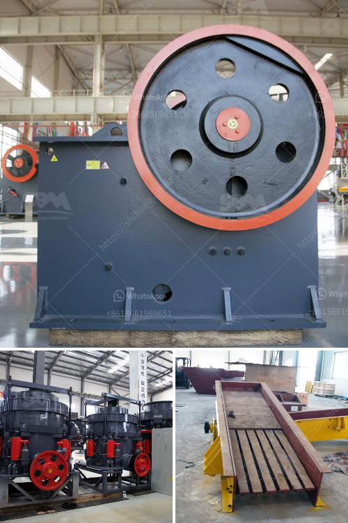

<h3>grinder for milling price in india</h3>
Grinding and milling are essential processes in various manufacturing industries, especially in India, where a wide range of materials need to be transformed into desired shapes and sizes. Whether it is metal, plastic, or wood, the milling process requires precision and efficiency to achieve optimal results. When it comes to finding a reliable grinder for milling, price plays a crucial role for any buyer.

In India, the market for grinders for milling is vast and diverse, offering a wide range of options to customers. The price of a grinder for milling depends on several factors, including brand reputation, features, power capacity, and size. The cost can vary significantly, ranging from as low as INR 10,000 to over INR 1,00,000, catering to different budgets and requirements.

While lower-priced mills may suffice for simpler machining tasks, investing in a higher-quality grinder for milling can offer numerous advantages. These premium machines often come equipped with advanced features, such as digital controls, variable speed settings, and improved durability. Additionally, they may have higher power capacities, enabling efficient processing of tough materials.

When considering the price of a grinder for milling, it is crucial to note the long-term benefits and cost-effectiveness of the equipment. Higher-priced machines often deliver superior performance, precision, and reliability, meaning less downtime and higher productivity in the long run. Moreover, reputable brands usually offer better customer support, warranties, and spare parts availability, ensuring a smooth operation and hassle-free maintenance of the equipment.

To make an informed decision about purchasing a grinder for milling in India, potential buyers should conduct market research, read customer reviews, and consult with industry experts. Comparing prices and features of different models from various manufacturers can help identify the best value for money. Additionally, considering the specific milling requirements and future scalability needs is essential to ensure the chosen machine can handle new challenges and growth.

In conclusion, the price of a grinder for milling in India can range from budget-friendly to premium, catering to different customer needs and budgets. While cost is an important factor to consider, potential buyers should also focus on the quality, efficiency, and long-term benefits of the equipment. Investing in a reliable grinder for milling can enhance productivity, precision, and overall profitability in various manufacturing industries.
<h3>Contact us</h3><ul><li><strong>Whatsapp:&nbsp;<a href="https://wa.me/8613661969651">+8613661969651</a></strong></li><li><a href="https://swt.shibang-china.com/?git&amp;zhl&amp;grinder for milling price in india"><strong>Online Service(chat now)</strong></a></li></ul><h3>Related</h3><ul><li><a href='sand washers machine.md'>sand washers machine</a></li><li><a href='impact crusher plant manufacturer.md'>impact crusher plant manufacturer</a></li><li><a href='secondary rock crusher for sale in south africa.md'>secondary rock crusher for sale in south africa</a></li><li><a href='rock drills for sale in south africa.md'>rock drills for sale in south africa</a></li><li><a href='small concrete crushers for low capacity.md'>small concrete crushers for low capacity</a></li></ul>