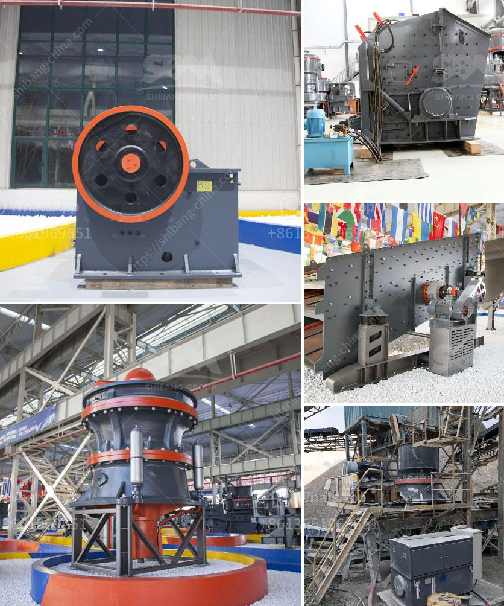

<h3>grinding ball mill equipment</h3>
The grinding ball mill equipment plays an important role in the mining industry, especially in the metallurgy industry. Grinding is the process of reducing the size of materials into fine particles, which is essential in extracting valuable minerals from ore. With its ability to grind various types of materials, this equipment has become a crucial tool in the industry.

One of the key advantages of grinding ball mill equipment is its adaptability. It can work with various materials, including ores, chemicals, ceramics, and paints. The equipment can be used for dry or wet grinding processes, depending on the material and desired particle size. This versatility enables mining companies to tailor the grinding process to their specific needs, ensuring high-quality and efficient results.

Efficiency is another critical aspect of grinding ball mill equipment in the mining industry. The equipment is designed to maximize the grinding process, using rotating cylinders filled with steel balls or other grinding media. As the material is fed into the mill, it is subjected to the grinding action, where the balls collide with the material, reducing it into smaller particles. The efficiency of the equipment greatly impacts the overall productivity and profitability of the mining operation, as it determines the amount of valuable minerals that can be extracted.

In addition to efficiency, the equipment is also designed for durability and reliability. The grinding ball mill is subjected to demanding conditions in the mining industry, including high temperatures and abrasive materials. To ensure its longevity, manufacturers use high-quality materials and robust construction techniques. This ensures that the equipment can withstand the harsh operating conditions, reducing the need for frequent maintenance and repairs.

Overall, grinding ball mill equipment plays a pivotal role in the mining industry. Its ability to grind various materials into fine particles with high efficiency and durability makes it an indispensable tool for extracting valuable minerals. As technology advances, manufacturers continue to improve the equipment, making it more efficient and reliable. With ongoing advancements, the grinding ball mill equipment will continue to be a vital component in mining operations worldwide.
<h3>Contact us</h3><ul><li><strong>Whatsapp:&nbsp;<a href="https://wa.me/8613661969651">+8613661969651</a></strong></li><li><a href="https://swt.shibang-china.com/?git&amp;zhl&amp;grinding ball mill equipment"><strong>Online Service(chat now)</strong></a></li></ul><h3>Related</h3><ul><li><a href='iron ore production from chrysotile.md'>iron ore production from chrysotile</a></li><li><a href='raymond mill spare part.md'>raymond mill spare part</a></li><li><a href='cost of a medium size stone crusher.md'>cost of a medium size stone crusher</a></li><li><a href='chinese ore processing plants.md'>chinese ore processing plants</a></li><li><a href='vibrating screen feeder.md'>vibrating screen feeder</a></li></ul>