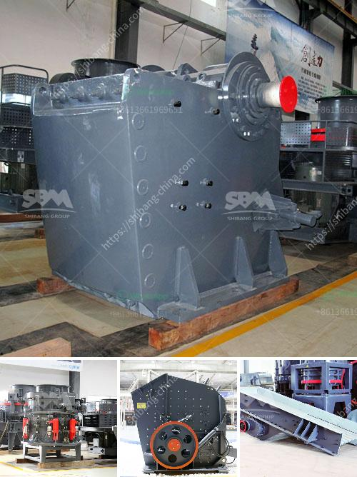

<h3>grinding calcium carbonate equipment</h3>
Calcium carbonate is widely used in various industries, such as paint, rubber, plastic, paper, ceramics and more. As a key ingredient in these products, it is necessary to grind calcium carbonate into a fine powder for further processing. In order to successfully grind calcium carbonate into the desired particle size, the right equipment is essential. In this article, we will explore the importance of grinding calcium carbonate equipment and its role in achieving success.

One of the main challenges in grinding calcium carbonate is the high hardness of the material. Calcium carbonate has a Mohs hardness of 3, meaning it is relatively hard and requires substantial grinding forces to break it down into smaller particles. Therefore, using proper equipment with sufficient grinding power is crucial. Grinding mills are commonly used for this purpose, and there are various types of mills available.

Ball mills are a popular choice for grinding calcium carbonate because they are easy to operate and highly efficient. A ball mill typically consists of a rotating drum filled with grinding media, such as ceramic balls, flint pebbles, or stainless steel balls. The grinding media continuously impacts and grinds the calcium carbonate particles inside the drum, resulting in the desired particle size reduction. Additionally, ball mills can be operated in both wet and dry conditions, allowing for flexibility in the grinding process.

Another commonly used equipment for grinding calcium carbonate is a Raymond mill. Raymond mills are known for their high efficiency and low energy consumption. The grinding process in a Raymond mill consists of a grinding ring and a grinding roller. The calcium carbonate is fed into the grinding ring, and the grinding roller rotates at a high speed, grinding the material into the desired particle size. The fine powder is then collected from the bottom of the mill through a cyclone separator or a bag filter.

In addition to ball mills and Raymond mills, there are other grinding equipment options available, such as vertical roller mills and ultrafine mills. Vertical roller mills are known for their high grinding efficiency and low energy consumption. They use a rotating grinding table to crush and grind the calcium carbonate against the rollers. Ultrafine mills, on the other hand, are designed for producing ultrafine calcium carbonate powder. They utilize high-speed impact and shear forces to break down the particles into smaller sizes.

When choosing the right grinding equipment for calcium carbonate, it is important to consider factors such as desired particle size, production capacity, energy consumption, and maintenance requirements. It is also essential to work with a reputable equipment supplier that can provide customized solutions and offer technical support.

In conclusion, grinding calcium carbonate is a crucial process in various industries, and the right equipment plays a critical role in achieving success. Ball mills, Raymond mills, and other grinding equipment options are available, each with its own advantages. By selecting the appropriate equipment and working with a reliable supplier, it is possible to efficiently grind calcium carbonate into the desired particle size, contributing to the success of various industries.
<h3>Contact us</h3><ul><li><strong>Whatsapp:&nbsp;<a href="https://wa.me/8613661969651">+8613661969651</a></strong></li><li><a href="https://swt.shibang-china.com/?git&amp;zhl&amp;grinding calcium carbonate equipment"><strong>Online Service(chat now)</strong></a></li></ul><h3>Related</h3><ul><li><a href='conveyor equipment in tanzania.md'>conveyor equipment in tanzania</a></li><li><a href='calcium carbonate powder coating machine in pune india.md'>calcium carbonate powder coating machine in pune india</a></li><li><a href='iron ore beneficiation process for sale.md'>iron ore beneficiation process for sale</a></li><li><a href='rock crusher dust fog control system philippines.md'>rock crusher dust fog control system philippines</a></li><li><a href='iron ore processing machine cost.md'>iron ore processing machine cost</a></li></ul>