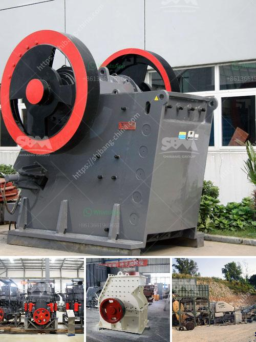

<h3>grinding equipment for cement plant</h3>
Cement manufacturing is an energy-intensive industry that relies heavily on grinding operations. To produce clinker, one of the main ingredients for cement production, a fine grinding process is necessary. This requires robust equipment that can handle large volumes of material and deliver a consistent and high-quality product.

In a cement plant, the grinding process consumes a significant amount of electrical energy. Therefore, investing in advanced grinding equipment can result in substantial cost savings and enhanced efficiency. Innovative technologies enable cement producers to optimize their grinding operations, reduce energy consumption, and minimize environmental impact.

One key aspect of grinding equipment for cement plants is its capability to handle various materials. From raw materials such as limestone and clay to additives and cement clinker, a versatile grinding machine is crucial to achieve the desired fineness and chemical composition. Whether it is a ball mill, roller press, or vertical roller mill, grinding equipment should be robust, reliable, and easy to maintain.

In recent years, there have been significant advancements in grinding equipment technology. For instance, advanced control systems now allow operators to monitor and adjust grinding parameters in real-time, resulting in more precise control over the grinding process. Additionally, equipment manufacturers have developed grinding aids that improve the grinding efficiency, reduce energy consumption, and enhance cement performance.

Apart from energy savings, modern grinding equipment also contributes to a cleaner and more sustainable cement production process. Dust collectors, air pollution control systems, and noise reduction measures are integrated into grinding equipment designs to comply with environmental regulations and ensure a safe working environment for plant personnel.

In conclusion, selecting the right grinding equipment for a cement plant is essential to achieve optimal grinding performance, reduce energy consumption, and enhance cement quality. With technological advancements and innovative solutions, cement producers can overcome operational challenges, increase productivity, and contribute to a more sustainable future for the industry.
<h3>Contact us</h3><ul><li><strong>Whatsapp:&nbsp;<a href="https://wa.me/8613661969651">+8613661969651</a></strong></li><li><a href="https://swt.shibang-china.com/?git&amp;zhl&amp;grinding equipment for cement plant"><strong>Online Service(chat now)</strong></a></li></ul><h3>Related</h3><ul><li><a href='safety sings for crusher plant and quarry.md'>safety sings for crusher plant and quarry</a></li><li><a href='indonesia copper processing equipment for sale.md'>indonesia copper processing equipment for sale</a></li><li><a href='hammer mill in malaysia.md'>hammer mill in malaysia</a></li><li><a href='petroleum coke mill.md'>petroleum coke mill</a></li><li><a href='sale for stone crusher.md'>sale for stone crusher</a></li></ul>