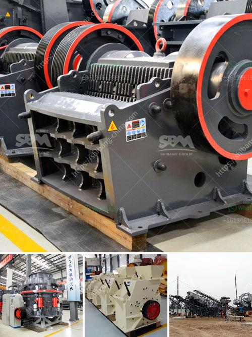

<h3>grinding machine for quartz stone</h3>
Quartz countertops have gained popularity in recent years due to their durability, aesthetic appeal, and low maintenance needs. The beauty of quartz stone lies in its natural variations, which give each countertop a unique and luxurious look. However, before it reaches the point of installation, quartz stone undergoes a complex manufacturing process, which includes the use of grinding machines.

A grinding machine is a tool used to shape solid materials and perform various functions such as grinding, polishing, and cutting. Grinding machines are commonly used for grinding and shaping materials such as glass, ceramics, metals, and plastics. The grinding process involves using abrasive wheels to remove excess material from the quartz stone and create the desired shape or finish.

One of the key benefits of quartz stone is its hardness. With a rating of 7 on the Mohs scale, quartz is incredibly durable and resistant to scratches and stains. However, even quartz stone may require grinding to remove deep scratches or imperfections. Grinding machines equipped with diamond grinding discs or other abrasives can be used for both wet and dry grinding, depending on the application.

In the case of quartz stone countertops, grinding is often done to create a smooth and uniform surface before the final polishing process. Grinding machines designed for this purpose typically feature diamond-impregnated grinding discs, which generate an intense grinding action. The resulting smooth surface not only enhances the appearance of the quartz stone but also makes it easier to clean and maintain.

Grinding machines for quartz stone are available in various sizes and configurations. From handheld grinders for small-scale projects to larger, industrial-grade machines, there is a machine suitable for every need. Some machines even feature multiple grinding heads or automated controls for increased efficiency and productivity.

In conclusion, grinding machines play a crucial role in the manufacturing of quartz stone countertops. They help shape and refine the stone, creating a smooth and polished surface that enhances its natural beauty. Whether for small-scale projects or large-scale production, grinding machines are essential tools for achieving high-quality quartz stone countertops.
<h3>Contact us</h3><ul><li><strong>Whatsapp:&nbsp;<a href="https://wa.me/8613661969651">+8613661969651</a></strong></li><li><a href="https://swt.shibang-china.com/?git&amp;zhl&amp;grinding machine for quartz stone"><strong>Online Service(chat now)</strong></a></li></ul><h3>Related</h3><ul><li><a href='barium carbonate manufacturing process.md'>barium carbonate manufacturing process</a></li><li><a href='black powder ball mill grinder.md'>black powder ball mill grinder</a></li><li><a href='slag cement manufacturing process youtube.md'>slag cement manufacturing process youtube</a></li><li><a href='crusher machine in gujranwala location.md'>crusher machine in gujranwala location</a></li><li><a href='magnesium sulfate production line equipment.md'>magnesium sulfate production line equipment</a></li></ul>