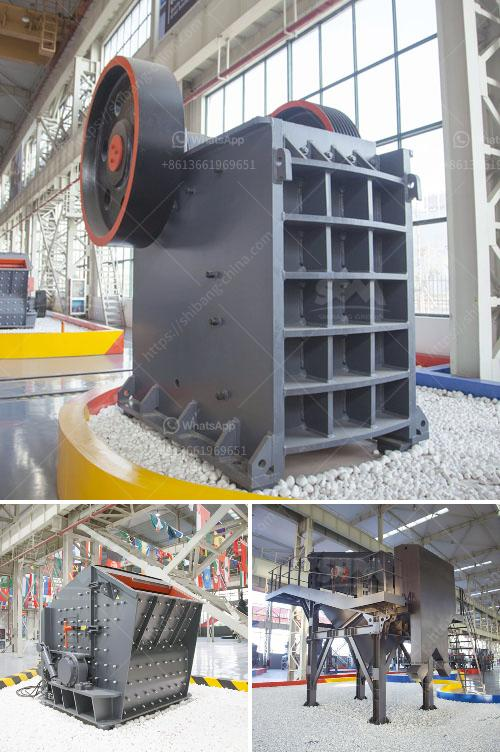

<h3>grinding mill for sale in zimbabwe</h3>
The mining industry in Zimbabwe is a significant contributor to the country's economy, as it brings in foreign currency earnings and provides employment opportunities for the local population. Zimbabwe has vast mineral resources, including gold, chrome, asbestos, platinum, coal, and copper, among others. These minerals are mined and processed into various forms, and one crucial step in this process is grinding.

Grinding mills play a key role in the comminution of minerals into the desired size, ready for further processing. The grinding process is a costly and energy-intensive step in the mining process, thus efficient grinding mills are crucial to the economic recovery of the resource. In Zimbabwe, the grinding mill machinery plays great roles in the mining industry. There are many different types of grinding mills available in Zimbabwe, but what kind of mills are more efficient for the mineral processing industry?

When choosing a grinding mill, there are various factors to consider, including the size of the intended product, the grinding media suitable for that size, and the mill's power requirements. Size reduction in the grinding process is mainly achieved through impact and attrition forces. Impact forces break the particles by direct collision with the grinding media, while attrition forces impart stress on the particles, causing them to fracture or cleave.

In Zimbabwe, most grinding mills employ a combination of these forces to achieve the desired size reduction. Some popular types of mills used in Zimbabwe include ball mills, hammer mills, stamp mills, and Raymond mills. These grinding machines are designed to grind either a few kilograms or a few tons of materials, depending on the scale of the operation.

Ball mills are the most commonly used grinding mills in Zimbabwe because they offer a large variety of grinding media, including both metallic and non-metallic options. These mills perform well in secondary grinding applications, where the feed size is relatively small. They are also widely used in the gold mining industry, where they can grind gold-bearing ores to a fine grain size, ready for further processing.

Stamp mills, on the other hand, are specialized grinding mills that require a skilled operator. They are commonly used in small-scale mining operations to crush and grind gold-bearing ores into smaller particles. The operator manually lifts and drops a heavy stamp onto the ore, which is then crushed and ground between the stamp and anvil.

Hammer mills, on the other hand, are versatile machines that can grind a variety of materials, including grains, minerals, and biomass. They are commonly used in the agricultural sector for grinding grain into flour, but they can also be used for processing ores, especially in small-scale mining operations.

Raymond mills are primarily used for grinding limestone, graphite, and other non-metallic minerals. They are known for their high efficiency and energy-saving capabilities. Raymond mills consist of a rotating shaft with multiple grinding rollers, which press against a circular grinding ring to grind the materials.

In conclusion, there are various grinding mills available in Zimbabwe for use in the mining industry. The choice of a grinding mill depends on factors such as the size of the intended product, the grinding media required, and the power requirements. Each type of mill has its advantages and disadvantages, and the choice ultimately depends on the specific requirements of the operation. Nonetheless, grinding mills are essential for the efficient processing of minerals and play a vital role in the economic recovery of Zimbabwe's mining industry.
<h3>Contact us</h3><ul><li><strong>Whatsapp:&nbsp;<a href="https://wa.me/8613661969651">+8613661969651</a></strong></li><li><a href="https://swt.shibang-china.com/?git&amp;zhl&amp;grinding mill for sale in zimbabwe"><strong>Online Service(chat now)</strong></a></li></ul><h3>Related</h3><ul><li><a href='list of machinery used in the quarry.md'>list of machinery used in the quarry</a></li><li><a href='vibrating grizzly feeder 35 ton per jam.md'>vibrating grizzly feeder 35 ton per jam</a></li><li><a href='stone crusher in usa.md'>stone crusher in usa</a></li><li><a href='diamond jaw crusher usa.md'>diamond jaw crusher usa</a></li><li><a href='cost gravel crusher.md'>cost gravel crusher</a></li></ul>