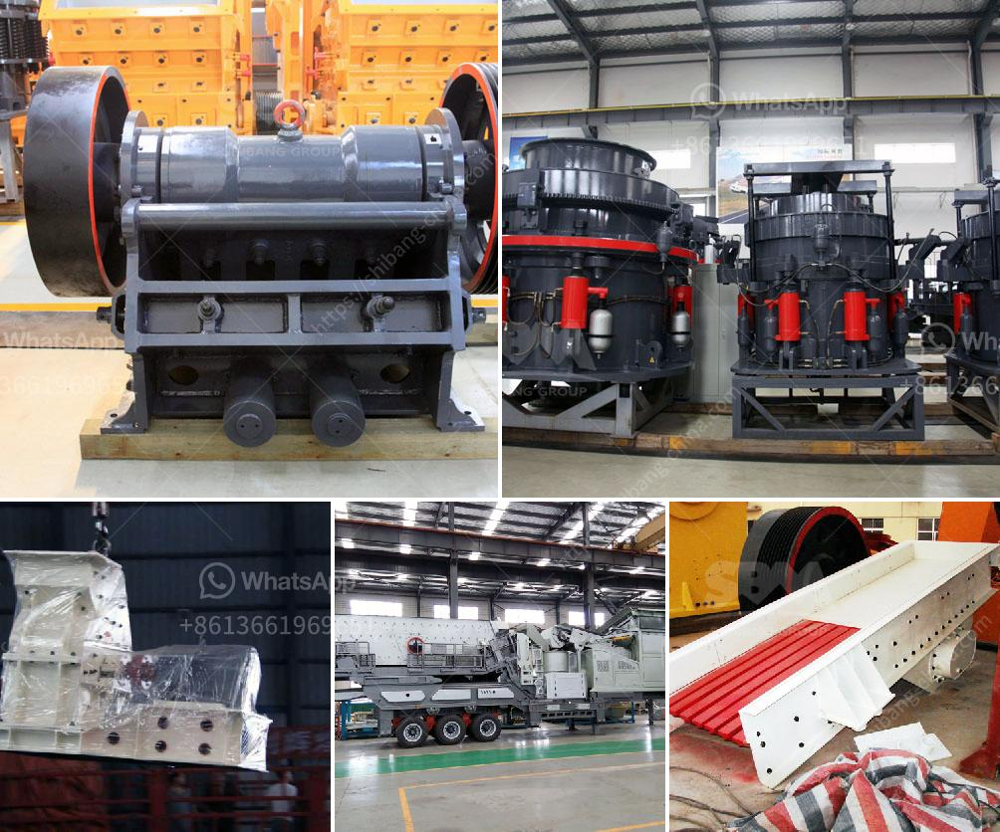

<h3>grinding mill machine for sale</h3>
In the ever-evolving world of technology, grinding mill machines are a modern invention that has revolutionized the grinding industry. Traditionally, grinding was done manually using hand tools that were time-consuming and labor-intensive. But with the introduction of grinding mill machines, the process has become quicker, more efficient, and cost-effective.

A grinding mill machine is a versatile tool that is used to pulverize different materials into tiny particles. These machines can grind various types of materials, such as stones, ores, minerals, and even grains. With the help of these machines, industries can achieve the desired particle size for their products.

One of the significant advantages of grinding mill machines is their ability to grind materials into different sizes. Depending on the desired output, these machines can produce coarse, medium, or fine particles. This flexibility allows industries to utilize the grindings for various purposes, from construction materials to pharmaceutical products.

Another crucial factor that makes grinding mill machines ideal for industries is their durability and efficiency. These machines are designed to withstand heavy-duty grinding operations, ensuring longevity and reliability. They are equipped with powerful motors and robust structures that can withstand high pressure and continuous usage.

The market today offers a variety of grinding mill machines for sale, catering to different industries' needs. These machines are available in different capacities, ranging from small-scale operations to large-scale industrial production. Additionally, manufacturers offer various features and specifications to meet the specific requirements of different industries.

Investing in a grinding mill machine is a wise decision for industries looking to enhance their production efficiency and meet their desired particle size requirements. With the advancement in technology, these machines continue to evolve, offering more advanced features and improved performance.

In conclusion, grinding mill machines have transformed the grinding industry by providing efficient, versatile, and durable solutions for industries worldwide. This innovation has revolutionized the grinding process, making it faster, more efficient, and cost-effective. As a result, industries can achieve the desired particle size and enhance their production output. With the variety of grinding mill machines available for sale, industries can choose the perfect machine that suits their requirements, ensuring optimal performance and productivity.
<h3>Contact us</h3><ul><li><strong>Whatsapp:&nbsp;<a href="https://wa.me/8613661969651">+8613661969651</a></strong></li><li><a href="https://swt.shibang-china.com/?git&amp;zhl&amp;grinding mill machine for sale"><strong>Online Service(chat now)</strong></a></li></ul><h3>Related</h3><ul><li><a href='quartz ball mill manufacturer hyderabad.md'>quartz ball mill manufacturer hyderabad</a></li><li><a href='belt and conveyor distributor in indonesia.md'>belt and conveyor distributor in indonesia</a></li><li><a href='ton gold wash plant for sale.md'>ton gold wash plant for sale</a></li><li><a href='calcium carbonate pulverizer.md'>calcium carbonate pulverizer</a></li><li><a href='artificial sand vs natural sand.md'>artificial sand vs natural sand</a></li></ul>