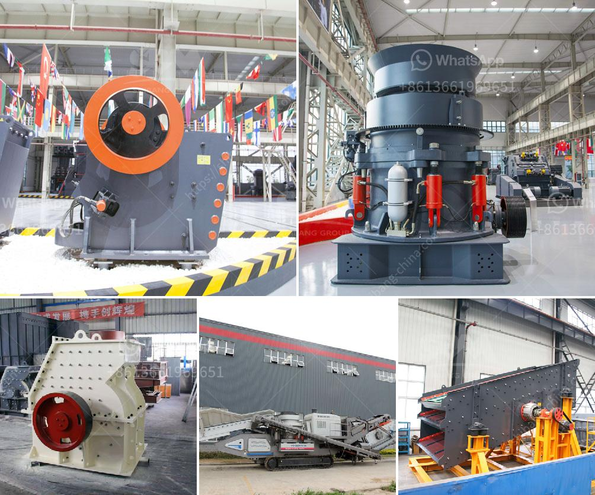

<h3>grinding mill machine in sri lanka</h3>
Sri Lanka is known for its rich cultural heritage and natural beauty. The island nation has been home to various industries and crafts throughout its history. One such industry that has flourished in Sri Lanka is the grinding mill machine industry. It is essential for today's manufacturing and construction industries, both of which rely heavily on materials that need to be ground into fine particles before they can be used.

Grinding mill machines are used to produce powdered raw materials, such as cement, ceramic, and food items. They are also widely used in the agriculture sector to grind raw materials into animal feed and forage, thereby enhancing livestock productivity. In addition, grinding mills are crucial for mining operations, as they finely grind the ore into a valuable product, ensuring efficient extraction of minerals.

The use of grinding mill machines contributes significantly to the economy of Sri Lanka. The machines are manufactured locally, which means they create employment opportunities for local citizens. Skilled and unskilled labor is required for the manufacturing and operation of these machines, providing steady income for many families. Moreover, as grinding mills are a necessary tool for several industries, their efficient operation ensures smooth production processes, leading to faster economic growth.

Another key benefit of grinding mill machines is the preservation of natural resources. These machines can grind and process a wide range of materials with minimal waste generation. By utilizing finely ground materials, manufacturers can optimize material usage, reducing the need for virgin resources. This helps conserve Sri Lanka's natural resources and promotes sustainability in various industries.

Furthermore, grinding mill machines play a vital role in enhancing food security in Sri Lanka. By grinding grains and other food ingredients into powder form, these machines allow for the easy production of flour, spices, and other food products. This not only improves the availability of food in the market but also ensures its affordability. The local population can access nutritious food items at a reasonable cost, promoting overall health and well-being.

In recent years, grinding mill machines in Sri Lanka have undergone several advancements to meet the evolving needs of different industries. The machines are now equipped with advanced technologies, such as computer numerical control (CNC) systems, that enhance precision, productivity, and energy efficiency. These advancements have further increased the competitiveness of Sri Lankan grinding mill machine manufacturers in the global market.

However, despite the numerous benefits and advancements, challenges remain for the grinding mill machine industry in Sri Lanka. One of the primary challenges is the lack of awareness and understanding among potential customers about the capabilities and benefits of these machines. Educational initiatives, trade fairs, and industry seminars can help bridge this gap and create a more informed market.

In conclusion, grinding mill machines are an essential tool for various industries in Sri Lanka. They aid in the manufacturing process, enhance food security, and promote sustainability while contributing to the nation's economic growth. With continued advancements and increased awareness, the grinding mill machine industry has the potential to play an even more significant role in the country's development, building a sustainable and prosperous future for Sri Lanka.
<h3>Contact us</h3><ul><li><strong>Whatsapp:&nbsp;<a href="https://wa.me/8613661969651">+8613661969651</a></strong></li><li><a href="https://swt.shibang-china.com/?git&amp;zhl&amp;grinding mill machine in sri lanka"><strong>Online Service(chat now)</strong></a></li></ul><h3>Related</h3><ul><li><a href='coal washing plant suppliers.md'>coal washing plant suppliers</a></li><li><a href='limestone crushing plant sale in pakistan.md'>limestone crushing plant sale in pakistan</a></li><li><a href='kenya cone crusher is manufactured.md'>kenya cone crusher is manufactured</a></li><li><a href='rock crushers for making gravel.md'>rock crushers for making gravel</a></li><li><a href='grinding equipment for cement plant.md'>grinding equipment for cement plant</a></li></ul>