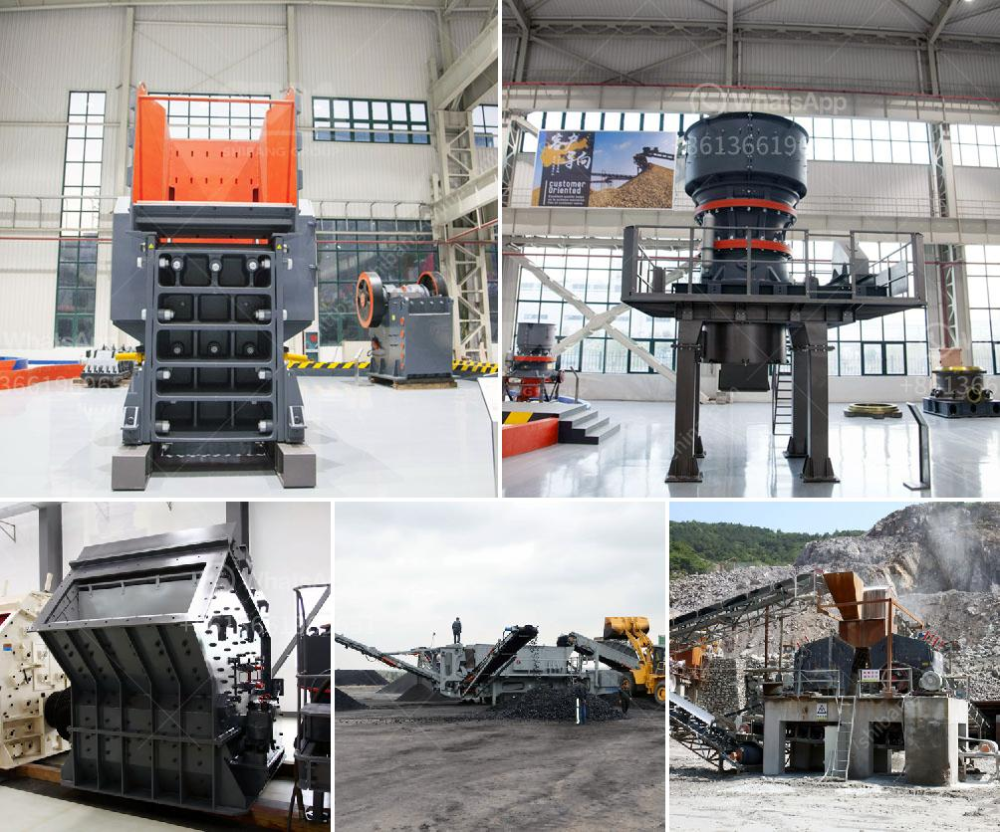

<h3>grinding mill to produce particle size</h3>
A grinding mill is a vital tool used in many industries to comminute and blend materials for the production of various products. From pharmaceuticals to chemicals and food processing, grinding mills are utilized to achieve the desired particle size distribution. The ability to control this particle size plays a crucial role in the overall performance and quality of the final product.

One of the key factors in selecting a grinding mill is its capability to produce a specific particle size range. By carefully adjusting the parameters and operating conditions, mills can generate particles ranging from fine powders to coarser granules. This control over particle size is critical for manufacturers, as it directly impacts the materials' properties and performance.

For example, in the pharmaceutical industry, medications are formulated in various dosage forms such as tablets, capsules, and suspensions. The efficacy and bioavailability of these drugs depend on the particle size distribution. A grinding mill with the ability to produce particles in the desired range ensures the drug's optimal dissolution and absorption, maximizing its therapeutic effects.

Similarly, in the chemical industry, the particle size of catalysts greatly influences their catalytic activity. Finely ground catalysts have larger surface areas, allowing for more efficient and faster reactions. Thus, a grinding mill capable of producing the desired particle size ensures better productivity and product quality.

In the food processing sector, grinding mills are used for various purposes, from reducing the size of ingredients for uniform mixing to achieving specific textures. For instance, in the production of powdered spices, grinding mills are employed to pulverize whole spices into fine powders, enhancing their flavor release during cooking.

To achieve the desired particle size, grinding mills employ different mechanisms like compression, impact, or attrition. Furthermore, modern grinding mills often incorporate advanced technologies such as air classification systems or adjustable rotor speeds to further refine the particle size distribution.

In conclusion, grinding mills are indispensable tools in achieving the desired particle size for a plethora of industries. With the ability to produce particles in the range of 100-300 micrometers, these mills allow manufacturers to optimize their products' properties and performance. The control over particle size ensures enhanced dissolution, improved catalytic activity, and efficient production in various sectors, thereby contributing to overall product quality and customer satisfaction.
<h3>Contact us</h3><ul><li><strong>Whatsapp:&nbsp;<a href="https://wa.me/8613661969651">+8613661969651</a></strong></li><li><a href="https://swt.shibang-china.com/?git&amp;zhl&amp;grinding mill to produce particle size"><strong>Online Service(chat now)</strong></a></li></ul><h3>Related</h3><ul><li><a href='mineral materials crushers.md'>mineral materials crushers</a></li><li><a href='primary crushers.md'>primary crushers</a></li><li><a href='ston crusher machine in nigeria.md'>ston crusher machine in nigeria</a></li><li><a href='3 pound ball mill in india.md'>3 pound ball mill in india</a></li><li><a href='stone crusher machine price in pakistan.md'>stone crusher machine price in pakistan</a></li></ul>