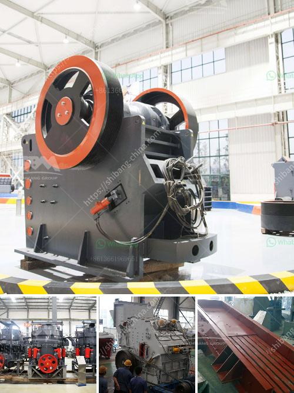

<h3>grinding steel balls for mining</h3>
The mining industry plays a vital role in our society by providing essential minerals and resources needed for various industrial applications. To extract valuable minerals from the ore, efficient processing techniques are necessary. One crucial aspect of ore processing is the grinding of the ore into fine particles. This process is accomplished using grinding mills, which utilize grinding steel balls.

Grinding steel balls are essential for efficiently reducing the size of the ore particles. These balls are typically made from a high-strength and wear-resistant alloy, such as chrome steel, stainless steel, or ceramic. They are designed to withstand heavy loads and repetitive impacts without losing their shape or integrity. As a result, they are the preferred choice for grinding ores in mining operations.

The primary function of grinding steel balls is to assist in the crushing and grinding process. When the ore is extracted from the mine, it is typically in large chunks that cannot be directly fed into the next stage of processing. These chunks are then broken down by crushing machines into smaller pieces. However, these smaller pieces are still too large for efficient processing, and this is where grinding comes in.

In the grinding mill, the ore is further reduced in size by the impact and abrasion caused by the grinding steel balls. As the mill rotates, the steel balls tumble and crush the ore into fine particles. This process increases the surface area of the ore, allowing for efficient extraction of valuable minerals through subsequent steps, such as flotation or leaching.

The quality of grinding steel balls is paramount for achieving efficient ore processing. Their durability and hardness play a crucial role in grinding efficiency. If the balls wear out too quickly or lose their shape, the grinding process becomes less efficient, leading to higher energy consumption and lower production rates. Therefore, mining companies must carefully select grinding balls that can withstand the demanding conditions of the grinding mills.

To ensure the quality and consistency of grinding steel balls, manufacturers employ various production methods. These methods involve precise heating, shaping, and heat treatment processes to obtain the desired properties. Quality control procedures, such as hardness testing, impact resistance, and uniformity, are also implemented to guarantee that the balls meet the required specifications.

Moreover, advancements in technology have further improved the performance of grinding steel balls in mining operations. For instance, manufacturers have developed advanced alloys and designs that exhibit superior wear resistance, increasing the lifespan of the balls and reducing maintenance costs. Additionally, advanced monitoring systems can give real-time feedback on the wear rates of steel balls, allowing for optimized replacement and efficient grinding.

In conclusion, grinding steel balls are crucial components in mining operations, facilitating the efficient processing of ores. By grinding the ore into fine particles, these balls increase the surface area, enabling more efficient extraction of valuable minerals. Mining companies must prioritize the quality and durability of grinding balls to ensure maximum production rates and minimize operational costs. Continuous research and development in steel ball manufacturing technologies will further enhance the efficiency and sustainability of the mining industry.
<h3>Contact us</h3><ul><li><strong>Whatsapp:&nbsp;<a href="https://wa.me/8613661969651">+8613661969651</a></strong></li><li><a href="https://swt.shibang-china.com/?git&amp;zhl&amp;grinding steel balls for mining"><strong>Online Service(chat now)</strong></a></li></ul><h3>Related</h3><ul><li><a href='types coal ball mill.md'>types coal ball mill</a></li><li><a href='small scale rock crusher.md'>small scale rock crusher</a></li><li><a href='price of jaw crusher in zimbabwe.md'>price of jaw crusher in zimbabwe</a></li><li><a href='mobile aggregate plant for sale in the philippines.md'>mobile aggregate plant for sale in the philippines</a></li><li><a href='grinding steel balls for mining.md'>grinding steel balls for mining</a></li></ul>