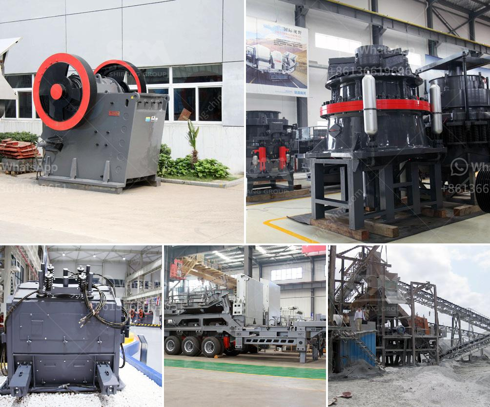

<h3>grinding wet ball mill limestone</h3>
Grinding wet ball mill limestone is one of the most widely used equipment in the limestone grinding process. Its main function is to grind limestone into powder with different sizes, which can be used in various industries. And as one of the key grinding equipment in the calcium carbonate production line, it is essential in many cement, lime, and mineral processing plants.

Wet ball mill limestone works by grinding limestone slurry, which is widely used in various industries such as power plants, metallurgy, chemical industry, and building materials. It grinds limestone particles into a fine powder with a certain particle size and makes them discharge through the sieve plate.

1. High grinding efficiency: The diameter of the wet ball mill limestone grinding body is larger than that of the dry ball mill, so the grinding efficiency is higher than that of the dry ball mill under the same conditions.

2. Good particle size control: Wet grinding can control the particle size distribution more accurately, ensuring a more uniform particle size and better product quality.

3. Energy-saving and environmental protection: Compared with dry ball mill grinding, wet ball mill limestone can effectively reduce energy consumption, reduce production costs, and achieve energy-saving and environmental protection effects.

4. Longer equipment life: Wet ball mill grinding can effectively reduce the wear of equipment parts, extend the service life of equipment, and reduce maintenance costs.

To achieve efficient and high-quality wet ball mill limestone grinding, there are several factors that need to be considered:

1. Milling equipment selection: The selection of high-quality milling equipment with suitable specifications and models can ensure the smooth operation and high efficiency of the grinding process.

2. Grinding media selection: The selection of suitable grinding media is essential to ensure the quality of the grinding process and the fineness of the limestone powder. Different types of grinding media have different effects on grinding efficiency and product quality, so it is necessary to choose the appropriate grinding media according to the specific grinding requirements.

3. Adjustment and control of operating parameters: The adjustment and control of operating parameters, such as the rotation speed of the mill, the filling rate of grinding media, the amount of limestone slurry, and the processing time, are crucial to ensure the stable operation of the wet ball mill and the achievement of the desired grinding effect.

In conclusion, grinding wet ball mill limestone is an essential equipment for calcium carbonate production, widely used in various industries. It has the advantages of high grinding efficiency, good particle size control, energy-saving and environmental protection, and longer equipment life. To achieve efficient and high-quality grinding, proper selection of milling equipment and grinding media, as well as adjustment and control of operating parameters, are necessary. With the continuous improvement and innovation of grinding technology, wet ball mill limestone is expected to play a more important role in the calcium carbonate production industry.
<h3>Contact us</h3><ul><li><strong>Whatsapp:&nbsp;<a href="https://wa.me/8613661969651">+8613661969651</a></strong></li><li><a href="https://swt.shibang-china.com/?git&amp;zhl&amp;grinding wet ball mill limestone"><strong>Online Service(chat now)</strong></a></li></ul><h3>Related</h3><ul><li><a href='portable limestone crushing systems.md'>portable limestone crushing systems</a></li><li><a href='price of central vertical roller mill.md'>price of central vertical roller mill</a></li><li><a href='granite quarry crusher equipment.md'>granite quarry crusher equipment</a></li><li><a href='kenya cone crusher is manufactured.md'>kenya cone crusher is manufactured</a></li><li><a href='aggregate quarry plant.md'>aggregate quarry plant</a></li></ul>