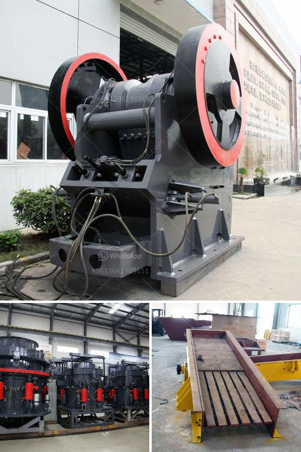

<h3>gypsum board making machine price in india</h3>
Gypsum board, also known as drywall or plasterboard, is a common construction material used all over the world. It is manufactured by combining gypsum, a natural mineral, with water and additives to create a slurry. This slurry is then poured between two layers of paper and dried to form a rigid board.

In India, the demand for gypsum board is rapidly increasing due to the thriving construction industry. As a result, the need for efficient and reliable gypsum board making machines is essential. These machines are responsible for producing high-quality gypsum boards that are used for interior walls, partitions, and ceilings in residential and commercial buildings.

When it comes to the price of gypsum board making machines in India, several factors come into play. These factors include machine capacity, production speed, automation level, and brand reputation. The machine capacity refers to the number of gypsum boards produced per unit of time, typically measured in square meters per hour. Higher machine capacities tend to increase the price, as they require more robust components and larger footprints.

Production speed is another important factor that affects the price of gypsum board making machines. Machines with higher production speeds are more efficient and can produce a larger quantity of gypsum boards in a shorter period. However, faster machines often come at a higher cost due to the need for advanced engineering and technology.

Automation level is also a significant consideration. Fully automatic machines require minimal manual intervention and can carry out most of the production process independently. These machines are more expensive but offer increased efficiency and productivity. On the other hand, semi-automatic machines require more manual labor and are generally more affordable.

Lastly, the reputation and brand of the gypsum board making machine manufacturer can influence its price. Well-established and reputed brands tend to charge higher prices for their machines due to their track record of delivering high-quality products and reliable after-sales services.

Considering all these factors, the price of gypsum board making machines in India can range from approximately INR 30 lakhs to INR 70 lakhs or even higher for larger, high-capacity machines. It is important to note that these prices are just estimates and may vary depending on the specific requirements and customization options requested by customers.

Investing in a high-quality gypsum board making machine is crucial for manufacturers looking to produce superior gypsum boards and meet the increasing demand. While the initial cost may seem on the higher side, it is essential to consider the long-term benefits and returns on investment that a reliable and efficient machine can offer.

In conclusion, the price of gypsum board making machines in India varies depending on factors such as machine capacity, production speed, automation level, and brand reputation. It is advisable for manufacturers to carefully evaluate their specific requirements and budget before making a purchase. By investing in a reliable and efficient machine, manufacturers can ensure the production of high-quality gypsum boards and stay competitive in the booming construction industry.
<h3>Contact us</h3><ul><li><strong>Whatsapp:&nbsp;<a href="https://wa.me/8613661969651">+8613661969651</a></strong></li><li><a href="https://swt.shibang-china.com/?git&amp;zhl&amp;gypsum board making machine price in india"><strong>Online Service(chat now)</strong></a></li></ul><h3>Related</h3><ul><li><a href='stone crushing plant of germany.md'>stone crushing plant of germany</a></li><li><a href='philippines crusher cebu crusher.md'>philippines crusher cebu crusher</a></li><li><a href='roll crusher kenya.md'>roll crusher kenya</a></li><li><a href='marble crusher equipment.md'>marble crusher equipment</a></li><li><a href='roller crusher company.md'>roller crusher company</a></li></ul>