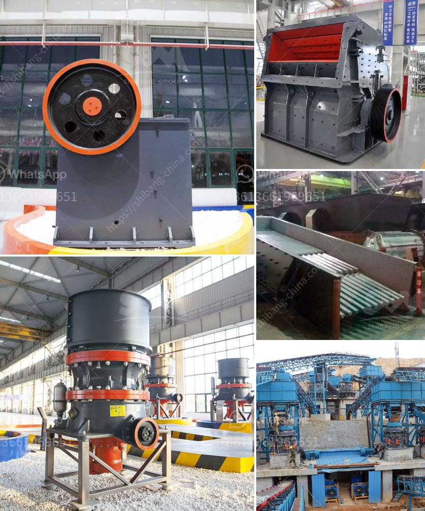

<h3>gypsum board manufacturing plant cost</h3>
Gypsum boards are recognized as a key material for the construction industry. They are widely used as interior walls, ceilings, and partitions due to their versatility, durability, and fire-resistant properties. The demand for gypsum boards is continuously increasing, which has led to the establishment of numerous manufacturing plants worldwide. However, before starting a gypsum board manufacturing plant, one must consider the cost involved.

The cost of setting up a gypsum board manufacturing plant primarily depends on the location of the plant and the scale of operations. Generally, a small-scale gypsum board manufacturing plant requires a space of around 5000-8000 square meters to set up. This space should include necessary machinery, equipment, and storage areas for raw materials and finished products.

The machinery and equipment required for a gypsum board manufacturing plant include crushers, conveyors, slurry making machines, kiln, board dryer, and packaging machines. You also need a gypsum board production line consisting of batching system, mixer, foaming station, board forming station, drying kiln, and curing chamber.

The cost of machinery and equipment varies depending on the level of automation and production capacity. On average, the machinery and equipment required for a gypsum board manufacturing plant cost around $1 million to $2 million. The biggest factors contributing to the cost are the capacity and automation level of the plant. Higher capacity plants with advanced automation can cost more.

Apart from machinery and equipment, the cost of raw materials is another significant factor to consider. The main raw material for gypsum board production is gypsum, which is widely available worldwide. Other materials required include water, adhesive, and additives to enhance the properties of gypsum boards. The cost of raw materials can vary depending on the location and supplier. It is essential to establish reliable supply chains to ensure cost-effective procurement of raw materials.

In addition to the machinery, equipment, and raw materials, labor costs must also be accounted for. The number of employees required depends on the scale of operations and automation level. A small-scale gypsum board manufacturing plant may require around 10-15 workers, while a larger plant can employ up to 50 workers. The labor cost can vary based on the region and prevailing wage rates.

Other costs that need consideration include utilities such as electricity, water, and gas, as well as permits, licenses, and taxes associated with setting up a manufacturing plant. It is crucial to conduct a thorough feasibility study to determine all the costs involved in establishing a gypsum board manufacturing plant.

Despite the initial setup costs, a gypsum board manufacturing plant can be a profitable venture due to the increasing demand for gypsum boards in the construction industry. These boards offer a cost-effective and sustainable solution for interior construction, making them a popular choice among builders and contractors. The cost of gypsum board manufacturing plant can be recouped in a relatively short period due to the high demand and steady growth in the construction sector.

In conclusion, setting up a gypsum board manufacturing plant requires substantial investment, primarily in machinery, equipment, and raw materials. However, with proper planning and market analysis, the investment can lead to a profitable and successful venture. The global demand for gypsum boards is on the rise, making it an opportune time to venture into this industry.
<h3>Contact us</h3><ul><li><strong>Whatsapp:&nbsp;<a href="https://wa.me/8613661969651">+8613661969651</a></strong></li><li><a href="https://swt.shibang-china.com/?git&amp;zhl&amp;gypsum board manufacturing plant cost"><strong>Online Service(chat now)</strong></a></li></ul><h3>Related</h3><ul><li><a href='ton gold wash plant for sale.md'>ton gold wash plant for sale</a></li><li><a href='hammer mill in malaysia.md'>hammer mill in malaysia</a></li><li><a href='harga screw conveyor batching plant.md'>harga screw conveyor batching plant</a></li><li><a href='three roller mill pakistan.md'>three roller mill pakistan</a></li><li><a href='biggest jaw crusher in the world.md'>biggest jaw crusher in the world</a></li></ul>