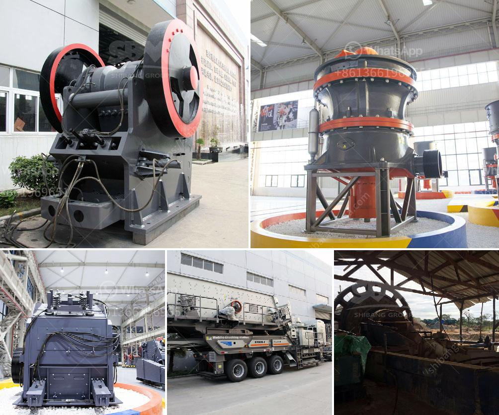

<h3>gypsum board manufacturing</h3>
Gypsum board is a common building material that is widely used in construction projects. Also known as drywall or plasterboard, gypsum board plays a crucial role in providing a smooth and even wall surface for various applications. In this article, we will explore the manufacturing process of gypsum board and understand its significance in the construction industry.

Gypsum board manufacturing involves several steps, each contributing to the quality and durability of the final product. The process starts with mining gypsum and extracting the mineral from the earth's crust. Gypsum is a naturally occurring rock that is composed of calcium sulfate dihydrate (CaSO4 · 2H2O).

Once the gypsum is extracted, it undergoes a series of crushing and grinding processes to reduce it into a fine powder. This powder is then heated in a calcination process to remove any remaining moisture and create hemihydrate gypsum (CaSO4 · 0.5H2O). This hemihydrate gypsum is the main component used in the manufacturing of gypsum board.

The next step in the manufacturing process is the preparation of the paper liner, which serves as the face and back paper of the gypsum board. The paper is typically made from recycled materials and is carefully selected for its strength, durability, and fire resistance properties.

Once the paper liner is prepared, it is fed into a gypsum board forming machine along with the hemihydrate gypsum. The machine combines the paper liner and the gypsum, forming a continuous sheet of gypsum board. Various additives, such as starch, foaming agents, and accelerators, may be added during this process to enhance the board's specific characteristics.

After the gypsum board is formed, it travels through a drying chamber to remove any remaining moisture. The drying process takes place in controlled conditions to ensure the board is dried thoroughly and evenly.

Once dried, the gypsum board is cut into desired lengths and undergoes a final quality inspection. The inspection checks for any defects, thickness variations, or imperfections that may affect the board's performance.

Gypsum board manufacturing is a sustainable process that incorporates eco-friendly practices. One key aspect is the recycling of paper used in the board's liner. Recycling helps reduce the demand for wood, lower energy consumption, and decrease landfill waste.

Gypsum board has several benefits that make it a popular choice in the construction industry. It is fire-resistant, providing an effective barrier against flames and heat. The board is also soundproof, improving acoustic performance and reducing noise transmission between rooms. Additionally, gypsum board is easy to install, repair, and decorate, making it a preferred choice for contractors and homeowners alike.

In conclusion, gypsum board manufacturing involves several steps, from mining and grinding gypsum to forming and drying the board. The process emphasizes quality control and sustainability, resulting in a durable and environmentally friendly building material. With its fire-resistant, soundproof, and easy-to-use properties, gypsum board continues to be a reliable choice for construction projects worldwide.
<h3>Contact us</h3><ul><li><strong>Whatsapp:&nbsp;<a href="https://wa.me/8613661969651">+8613661969651</a></strong></li><li><a href="https://swt.shibang-china.com/?git&amp;zhl&amp;gypsum board manufacturing"><strong>Online Service(chat now)</strong></a></li></ul><h3>Related</h3><ul><li><a href='aggregate roller crushing mill malaysia.md'>aggregate roller crushing mill malaysia</a></li><li><a href='dry ball mill for silica powder.md'>dry ball mill for silica powder</a></li><li><a href='mobile chrome wash plant for sale.md'>mobile chrome wash plant for sale</a></li><li><a href='micron limestone grinding unit in india.md'>micron limestone grinding unit in india</a></li><li><a href='quarry crusher equipment manufacturer in germany.md'>quarry crusher equipment manufacturer in germany</a></li></ul>