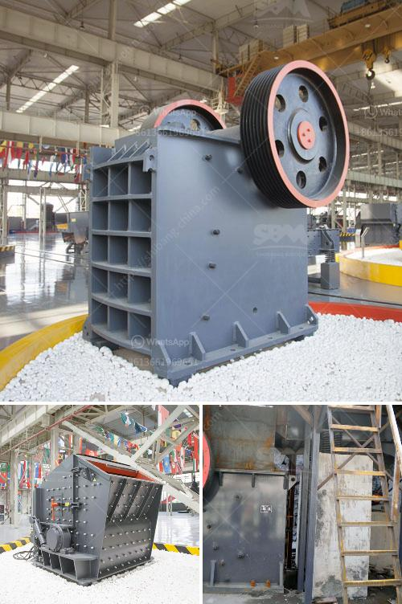

<h3>gypsum crusher machine for sale</h3>
Gypsum is a mineral found in, or formed by the evaporative deposition of calcium sulfate. It is one of the most valuable natural resources used in a wide range of applications including the production of plaster and building materials, as well as soil conditioning and fertilizer improvement. To extract gypsum, a mining operation is required, which involves drilling, blasting, crushing, and grinding the rock to a fine powder.

To efficiently process gypsum, the ore must be finely crushed before it can be used in the industrial sector. A gypsum crusher machine is essential for this process, as it will generate the required particles in a more user-friendly manner. Crushing gypsum can be performed either by pressure or impact. This depends on the gypsum properties. Hardness, elasticity, and fracture behavior are factors that play a role in determining the type of crusher to be used.

In terms of the crushing equipment, there are primarily two types of gypsum crushers available in the market: the jaw crusher and the impact crusher. The jaw crusher is used to crush large-sized gypsum ore into smaller particles, while the impact crusher is used to crush smaller sized gypsum ore into fines. The finely crushed gypsum ore is then sieved to obtain the desired particle size.

When looking for a gypsum crusher machine for sale, there are a few important considerations to keep in mind. The machine's size determines the overall productivity. A machine with a smaller capacity may not be able to meet the demands of a large-scale gypsum production line, while a machine that is too large may result in unnecessary expenses. Energy consumption is another crucial factor to consider. Opting for a machine that is energy-efficient will reduce operational costs in the long run.

Lastly, maintenance and after-sales support are important factors to consider. Look for a reliable supplier with a good reputation in the industry that offers excellent customer service, spare parts, and technical support. A machine with a robust design that is easy to maintain will ensure smooth operations and maximize uptime.

In conclusion, a gypsum crusher machine is essential in the gypsum extraction process. It helps break the large-sized gypsum ore into smaller particles and prepares it for further processing. When looking for a gypsum crusher machine for sale, it is important to ensure that the machine meets the specific requirements and is supported by a reliable supplier. Through careful consideration of size, energy consumption, and maintenance requirements, one can find a suitable gypsum crusher machine that offers high productivity and cost-efficiency.
<h3>Contact us</h3><ul><li><strong>Whatsapp:&nbsp;<a href="https://wa.me/8613661969651">+8613661969651</a></strong></li><li><a href="https://swt.shibang-china.com/?git&amp;zhl&amp;gypsum crusher machine for sale"><strong>Online Service(chat now)</strong></a></li></ul><h3>Related</h3><ul><li><a href='turnkey consultant for calcium carbonate plant in india.md'>turnkey consultant for calcium carbonate plant in india</a></li><li><a href='mica powder machine.md'>mica powder machine</a></li><li><a href='closs size setting jaw crusher.md'>closs size setting jaw crusher</a></li><li><a href='usa vertical roller mill.md'>usa vertical roller mill</a></li><li><a href='maize grinding mill in philippines south africa.md'>maize grinding mill in philippines south africa</a></li></ul>