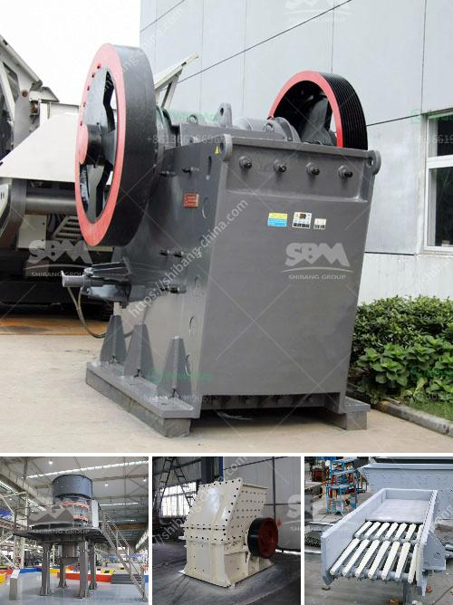

<h3>gypsum crusher plant pdf</h3>
Gypsum, a mineral rock, is a versatile material that is used in various industries. It is the primary ingredient in gypsum board, a wall material that is used in residential and commercial construction. Gypsum is also used in the production of plaster of Paris, cement, and fertilizer. In order to extract and process gypsum, the rock must be mined and then crushed into smaller pieces. This is where a gypsum crusher plant comes in.

A gypsum crusher plant consists of a primary crusher, secondary crusher, and tertiary crusher, each with different specifications and capabilities. The primary crusher breaks the large-sized gypsum ore into smaller pieces of less than 30mm. The secondary crusher further reduces the size to 25mm or smaller. The tertiary crusher produces the final size of 10mm to 20mm.

Gypsum has a wide range of applications in various industries, making the demand for gypsum crusher plants high. To meet the ever-increasing demand for gypsum, there are several manufacturers in the market offering different types of gypsum crusher plants. These plants aim to provide efficient and cost-effective solutions for gypsum processing.

One of the popular gypsum crusher plants is the portable crushing plant. This plant can be easily transported to different locations and is suitable for temporary crushing jobs. It is flexible and convenient to use, making it ideal for on-site crushing of gypsum. The portable crushing plant is equipped with a vibrating feeder, jaw crusher, impact crusher, vibrating screen, and belt conveyor. This plant is efficient and produces high-quality gypsum products.

Another type of gypsum crusher plant is the track-mounted crushing plant. This plant is highly mobile and can be easily transported to different locations. It is designed to crush gypsum quickly and efficiently. The track-mounted crushing plant is equipped with a vibrating feeder, primary jaw crusher, and tertiary impact crusher. It can produce high-quality gypsum products with various sizes.

In conclusion, a gypsum crusher plant plays a crucial role in gypsum processing. It breaks the large-sized gypsum ore into smaller pieces and produces high-quality gypsum products. There are different types of gypsum crusher plants available in the market, each with different specifications and capabilities. The popular ones include portable crushing plants and track-mounted crushing plants. These plants are efficient, cost-effective, and can be easily transported to different locations. With the increasing demand for gypsum, these crusher plants provide an excellent solution for gypsum processing.
<h3>Contact us</h3><ul><li><strong>Whatsapp:&nbsp;<a href="https://wa.me/8613661969651">+8613661969651</a></strong></li><li><a href="https://swt.shibang-china.com/?git&amp;zhl&amp;gypsum crusher plant pdf"><strong>Online Service(chat now)</strong></a></li></ul><h3>Related</h3><ul><li><a href='marble powder crusher plant.md'>marble powder crusher plant</a></li><li><a href='stone paper production process.md'>stone paper production process</a></li><li><a href='crusher plant for sale in south africa.md'>crusher plant for sale in south africa</a></li><li><a href='jaw crusher shaft parts diagram.md'>jaw crusher shaft parts diagram</a></li><li><a href='price for cone crusher.md'>price for cone crusher</a></li></ul>